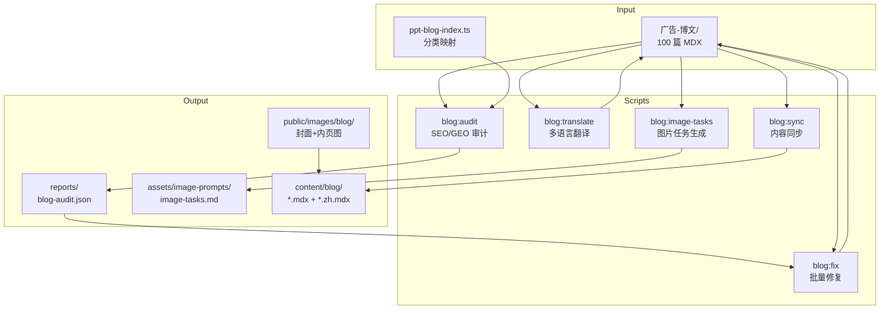

# Design Document: Blog Content Pipeline

## Overview

本设计文档描述博客内容处理流水线的技术架构和实现方案。流水线采用脚本化批处理架构，通过一系列 Node.js 脚本实现博文的审计、修复、翻译和迁移，支持手工图片生成流程。

### 核心设计原则

1. **脚本化处理**: 所有处理逻辑封装为可独立运行的脚本
2. **状态追踪**: 通过 JSON 索引文件追踪每篇文章的处理状态
3. **增量处理**: 支持断点续传，避免重复处理已完成的文章
4. **备份优先**: 所有修改前保留原文件备份
5. **草稿优先**: 所有新代码先放在 `draft-code/` 目录，校验通过后再迁移

### 代码存放规范

> **重要**: 所有新生成的脚本、配置文件、代码都先放在以下目录：
>
> ```
> 深入细化调整/006-01-博客内容创作/draft-code/
> ├── scripts/           # 脚本代码
> │   ├── blog-audit/    # 审计脚本
> │   ├── blog-fix/      # 修复脚本
> │   ├── blog-translate/# 翻译脚本
> │   ├── blog-image-tasks/ # 图片任务脚本
> │   └── blog-sync/     # 同步脚本
> ├── config/            # 配置文件
> ├── reports/           # 输出报告
> └── README.md          # 使用说明
> ```
>
> **迁移流程**:
> 1. 在 `draft-code/` 中开发和测试
> 2. 运行测试验证功能正确
> 3. 人工审核代码质量
> 4. 迁移到主项目 `scripts/` 目录
> 5. 更新 `package.json` 添加命令
5. **草稿优先**: 所有代码先放在 draft-code 目录，校验通过后再迁移到主代码

## 代码组织规范

### 草稿代码目录结构

所有新增的脚本和代码文件统一放在以下目录：

```
深入细化调整/006-01-博客内容创作/draft-code/
├── scripts/
│   ├── blog-audit/           # 审计脚本
│   │   ├── index.ts
│   │   ├── category-map.ts
│   │   ├── rules.ts
│   │   └── index.test.ts
│   ├── blog-fix/             # 修复脚本
│   │   ├── index.ts
│   │   └── index.test.ts
│   ├── blog-translate/       # 翻译脚本
│   │   ├── index.ts
│   │   └── index.test.ts
│   ├── blog-image-tasks/     # 图片任务生成
│   │   ├── index.ts
│   │   └── index.test.ts
│   └── blog-sync/            # 同步脚本
│       ├── index.ts
│       └── index.test.ts
├── reports/                  # 审计报告输出
│   └── blog-audit.json
├── assets/
│   └── image-prompts/        # 图片任务清单
│       └── image-tasks.md
└── README.md                 # 使用说明和迁移指南
```

### 迁移流程

1. **开发阶段**: 所有代码在 `draft-code/` 目录下开发和测试
2. **校验阶段**: 运行测试确保功能正确，人工审核代码质量
3. **迁移阶段**: 校验通过后，将脚本迁移到 `scripts/` 主目录
4. **集成阶段**: 在 `package.json` 中添加命令入口

### 迁移检查清单

迁移前需确认：
- [ ] 所有测试通过
- [ ] 代码风格符合项目规范（Biome）
- [ ] 类型定义完整无 any
- [ ] 错误处理完善
- [ ] 日志输出清晰
- [ ] README 文档完整

## Architecture



## Components and Interfaces

### 1. 分类映射常量

```typescript
// 深入细化调整/006-01-博客内容创作/draft-code/scripts/blog-audit/category-map.ts
// 备注：校验通过后迁移到 scripts/blog-audit/category-map.ts

export const categoryMapping: Record<string, string> = {
  '商务汇报': 'business',
  '教育培训': 'education',
  '培训课件': 'training',
  '产品营销': 'marketing',
  '营销方案': 'marketing-plan',
  '年终总结': 'year-end',
  '项目提案': 'proposal',
  '述职报告': 'report',
  '通用': 'general',
  '付费与搜索': 'paid-search',
};

export const categoryStyles: Record<string, CategoryStyle> = {
  business: {
    name: '商务汇报',
    colors: ['#1E3A5F', '#2C5282', '#FFFFFF'],
    style: '深蓝/灰、极简网格、数据卡片/折线、科技光影',
    tone: '决策支持、复盘、要点速览',
  },
  'year-end': {
    name: '年终总结',
    colors: ['#C53030', '#DD6B20', '#F6E05E'],
    style: '暖色/中性、时间线+图表、稳重',
    tone: '成绩/复盘/计划、可信证据链',
  },
  education: {
    name: '教育培训',
    colors: ['#38A169', '#3182CE', '#F6E05E'],
    style: '明快、高对比、插画式人物、卡片分组',
    tone: '互动、易学、步骤化',
  },
  marketing: {
    name: '产品营销',
    colors: ['#D53F8C', '#805AD5', '#38B2AC'],
    style: '高对比、大标题、渐变/霓虹、场景 mock',
    tone: '转化、A/B、亮点/钩子',
  },
  // ... 其他分类
};

interface CategoryStyle {
  name: string;
  colors: string[];
  style: string;
  tone: string;
}
```

### 2. 审计脚本接口

```typescript
// 深入细化调整/006-01-博客内容创作/draft-code/scripts/blog-audit/index.ts
// 备注：校验通过后迁移到 scripts/blog-audit/index.ts

interface AuditConfig {
  sourceDir: string;           // 源目录路径
  outputPath: string;          // 报告输出路径
  rules: AuditRules;           // 审计规则配置
}

interface AuditRules {
  titleLength: { min: number; max: number };      // 25-35 中文字符
  descLength: { min: number; max: number };       // 70-100 中文字符
  minH2: number;                                   // ≥5
  minH3: number;                                   // ≥5
  minInternalLinks: number;                        // ≥3
  minExternalLinks: number;                        // ≥1
  minAuthorityQuotes: number;                      // ≥2
  minStats: number;                                // ≥2
  minImages: number;                               // ≥3
  requireFAQ: boolean;                             // true
}

interface BlogAuditResult {
  slug: string;
  locale: string;
  issues: IssueType[];
  stats: AuditStats;
  frontmatter: FrontmatterData;
}

type IssueType =
  | 'missing_description'
  | 'short_title'
  | 'long_title'
  | 'short_desc'
  | 'no_cover'
  | 'few_images'
  | 'no_internal_links'
  | 'no_external_links'
  | 'no_authoritative_quote'
  | 'no_stats'
  | 'few_h2'
  | 'few_h3'
  | 'no_faq'
  | 'missing_en'
  | 'bad_date'
  | 'missing_category'
  | 'missing_author';

interface AuditStats {
  wordCount: number;
  h2Count: number;
  h3Count: number;
  internalLinks: number;
  externalLinks: number;
  images: number;
  titleLen: number;
  descLen: number;
  authorityQuotes: number;
  statsCount: number;
}

// 主函数
async function auditBlogs(config: AuditConfig): Promise<BlogAuditResult[]>;
```

### 3. 修复脚本接口

```typescript
// 深入细化调整/006-01-博客内容创作/draft-code/scripts/blog-fix/index.ts
// 备注：校验通过后迁移到 scripts/blog-fix/index.ts

interface FixConfig {
  sourceDir: string;
  auditReport: string;         // blog-audit.json 路径
  fixTypes: FixType[];         // 要执行的修复类型
  dryRun: boolean;             // 是否只预览不修改
}

type FixType =
  | 'fix-category'
  | 'fix-date'
  | 'fix-image-path'
  | 'add-tags'
  | 'add-seo-keywords'
  | 'add-related-posts'
  | 'add-internal-links'
  | 'add-authority-quotes'
  | 'add-stats'
  | 'add-faq'
  | 'add-image-placeholders'
  | 'add-cta';

interface FixResult {
  slug: string;
  fixesApplied: FixType[];
  success: boolean;
  error?: string;
}

async function fixBlogs(config: FixConfig): Promise<FixResult[]>;
```

### 4. 翻译脚本接口

```typescript
// 深入细化调整/006-01-博客内容创作/draft-code/scripts/blog-translate/index.ts
// 备注：校验通过后迁移到 scripts/blog-translate/index.ts

interface TranslateConfig {
  sourceDir: string;
  targetLocale: 'en';
  categoryMapping: Record<string, string>;
  skipExisting: boolean;       // 跳过已有英文版的文章
}

interface TranslateResult {
  slug: string;
  sourceFile: string;
  targetFile: string;
  success: boolean;
  error?: string;
}

// 翻译 Prompt 模板
const translatePrompt = `
Role: Expert Translator (Chinese to English)
Task: Translate the following MDX blog post into Native American English.

Constraints:
1. Frontmatter:
   - Translate title and description
   - KEEP date, image, published, author UNCHANGED
   - Translate categories using mapping: {categoryMapping}
   - Translate tags appropriately

2. Content:
   - Maintain MDX structure and components (<Callout> etc.)
   - Keep image paths unchanged
   - Keep internal links (/blog/{slug}) unchanged
   - Translate naturally, not literally
   - Use business-appropriate tone

3. Output:
   - File naming: {slug}.mdx (Chinese version is {slug}.zh.mdx)
`;

async function translateBlogs(config: TranslateConfig): Promise<TranslateResult[]>;
```

### 5. 图片任务生成接口

```typescript
// 深入细化调整/006-01-博客内容创作/draft-code/scripts/blog-image-tasks/index.ts
// 备注：校验通过后迁移到 scripts/blog-image-tasks/index.ts

interface ImageTaskConfig {
  sourceDir: string;
  outputPath: string;          // image-tasks.md 输出路径
  categoryStyles: Record<string, CategoryStyle>;
}

interface ImageTask {
  slug: string;
  title: string;
  category: string;
  styleHint: string;
  palette: string[];
  sceneElements: string[];
  scenes: string[];            // 3-4 个内页场景描述
  textToRender: string;        // 封面文字（短中文或"留白"）
  coverPrompt: string;         // 生成的封面 Prompt
  inlinePrompts: string[];     // 生成的内页 Prompts
  coverDone: boolean;
  inlineDone: number;          // 已完成的内页数量
  uploaded: boolean;
}

// 封面 Prompt 模板
const coverPromptTemplate = `
你是专业平面设计师，请生成 1200x630 的博客封面图，风格 {styleHint}。
主题：{title}
关键词：{keywords}
需包含的文字：{textToRender}
画面元素：{sceneElements}
颜色：{palette}
构图：简洁、可读性高，避免过度细节；背景干净以便叠字。
输出：无水印，无多余文字，高清。
`;

// 内页 Prompt 模板
const inlinePromptTemplate = `
生成 1000x600 的信息图/情景图，风格 {styleHint}。
场景：{scene}
画面元素：{elements}
颜色：{palette}
要求：清晰、简洁、无水印，文字极少（仅短标签），适合博客正文插图。
`;

async function generateImageTasks(config: ImageTaskConfig): Promise<ImageTask[]>;
```

### 6. 同步脚本接口

```typescript
// 深入细化调整/006-01-博客内容创作/draft-code/scripts/blog-sync/index.ts
// 备注：校验通过后迁移到 scripts/blog-sync/index.ts

interface SyncConfig {
  sourceDir: string;           // 广告-博文/
  targetDir: string;           // content/blog/
  imageSourceDir: string;      // 图片源目录
  imageTargetDir: string;      // public/images/blog/
  validateSchema: boolean;     // 是否运行 pnpm content 验证
}

interface SyncResult {
  totalFiles: number;
  syncedFiles: number;
  skippedFiles: number;
  errors: Array<{ file: string; error: string }>;
  schemaValid: boolean;
}

async function syncBlogs(config: SyncConfig): Promise<SyncResult>;
```

## Data Models

### 博客索引数据模型

```typescript
// 深入细化调整/006-01-博客内容创作/draft-code/reports/blog-audit.json 结构
// 备注：审计报告输出到 draft-code/reports/ 目录

interface BlogIndex {
  slug: string;
  locale: 'zh' | 'en';
  title: string;
  description: string;
  date: string;                // YYYY-MM-DD
  categories: string[];
  tags: string[];
  seoKeywords: string[];
  image: string;
  wordCount: number;
  heroImages: number;
  internalLinks: number;
  externalLinks: number;
  status: 'ok' | 'needs_fix';
  mediaStatus: 'missing' | 'partial' | 'done';
  issues: IssueType[];
  filePath: string;
}

interface BlogAuditReport {
  generatedAt: string;
  totalFiles: number;
  summary: {
    ok: number;
    needsFix: number;
    missingEn: number;
    missingMedia: number;
  };
  issueStats: Record<IssueType, number>;
  items: BlogIndex[];
}
```

### 图片任务清单数据模型

```typescript
// 深入细化调整/006-01-博客内容创作/draft-code/assets/image-prompts/image-tasks.md 结构
// 备注：图片任务清单输出到 draft-code/assets/ 目录

interface ImageTasksReport {
  generatedAt: string;
  totalTasks: number;
  completed: {
    covers: number;
    inlines: number;
    uploaded: number;
  };
  tasks: ImageTask[];
}
```

## Correctness Properties

*A property is a characteristic or behavior that should hold true across all valid executions of a system-essentially, a formal statement about what the system should do. Properties serve as the bridge between human-readable specifications and machine-verifiable correctness guarantees.*

### Property 1: 分类映射完整性
*For any* 中文分类名称，映射表应返回对应的英文 slug，且映射关系是双射（一一对应）。
**Validates: Requirements 1.1**

### Property 2: 索引结构完整性
*For any* 生成的索引条目，应包含所有必需字段（slug, locale, title, description, date, categories, image, status, issues）。
**Validates: Requirements 1.3**

### Property 3: 标题长度检查
*For any* 中文标题，审计结果应正确标记长度是否在 25-35 字符范围内。
**Validates: Requirements 2.1**

### Property 4: 描述长度检查
*For any* 中文描述，审计结果应正确标记长度是否在 70-100 字符范围内。
**Validates: Requirements 2.2**

### Property 5: 标题结构检查
*For any* MDX 正文，审计结果应正确统计 H2 和 H3 标题数量。
**Validates: Requirements 2.3**

### Property 6: 链接分类检查
*For any* MDX 正文中的链接，审计应正确区分内部链接（以 / 开头或本站域名）和外部链接。
**Validates: Requirements 2.4**

### Property 7: 权威引用检测
*For any* MDX 正文，审计应正确检测包含权威来源关键词的引用数量。
**Validates: Requirements 2.5**

### Property 8: 统计数据检测
*For any* MDX 正文，审计应正确检测包含百分比或数字+报告关键词的统计数据数量。
**Validates: Requirements 2.6**

### Property 9: 图片检测
*For any* MDX 正文，审计应正确统计图片数量并检查 alt 文本是否非空。
**Validates: Requirements 2.7**

### Property 10: 分类修复正确性
*For any* 包含中文分类的 Frontmatter，修复后应转换为对应的英文 slug。
**Validates: Requirements 3.1**

### Property 11: 日期格式修复
*For any* 日期字段，修复后应符合 YYYY-MM-DD 格式。
**Validates: Requirements 3.2**

### Property 12: 封面图路径格式
*For any* 修复后的 image 字段，应符合 /images/blog/{slug}-cover.jpg 格式。
**Validates: Requirements 3.3**

### Property 13: 内部链接修复
*For any* 内部链接不足的文章，修复后应包含 ≥3 个内部链接。
**Validates: Requirements 4.1**

### Property 14: 翻译文件配对
*For any* 翻译后的文章，应存在 {slug}.mdx 和 {slug}.zh.mdx 成对文件。
**Validates: Requirements 5.1**

### Property 15: 翻译 Frontmatter 保持
*For any* 翻译后的 Frontmatter，date、image、published、author 字段应与原文相同。
**Validates: Requirements 5.2**

### Property 16: 翻译路径保持
*For any* 翻译后的正文，图片路径和内部链接路径应与原文相同。
**Validates: Requirements 5.5**

### Property 17: 封面图尺寸
*For any* 生成的封面图，尺寸应为 1200x630 像素，文件大小应小于 200KB。
**Validates: Requirements 6.1**

### Property 18: 内容图尺寸
*For any* 生成的内容图，尺寸应为 1000x600 像素，文件大小应小于 150KB。
**Validates: Requirements 6.2**

### Property 19: 图片命名规范
*For any* 生成的图片，封面应命名为 {slug}-cover.jpg，内页应命名为 {slug}-{n}.png。
**Validates: Requirements 6.5**

### Property 20: 图片任务清单完整性
*For any* 生成的图片任务，应包含 slug、title、category、styleHint、scenes、coverPrompt、inlinePrompts 字段。
**Validates: Requirements 7.1, 7.2, 7.3**

### Property 21: 验收 issues 清零
*For any* 通过验收的文章，核心 issues（no_cover、few_images、no_internal_links、no_authoritative_quote、missing_en）应全部清零。
**Validates: Requirements 10.1**

### Property 22: 验收文件配对
*For any* 通过验收的文章，应存在中英文成对文件且分类映射正确。
**Validates: Requirements 10.2**

### Property 23: 验收图片可用
*For any* 通过验收的文章，所有图片路径应可访问（无 404）。
**Validates: Requirements 10.3**

## Error Handling

### 审计错误处理

| 错误类型 | 处理策略 |
|---------|---------|
| MDX 解析失败 | 记录错误，标记 status: 'parse_error'，继续处理其他文件 |
| Frontmatter 缺失 | 标记 issues: ['missing_frontmatter']，继续审计正文 |
| 文件读取失败 | 记录错误到报告，跳过该文件 |

### 修复错误处理

| 错误类型 | 处理策略 |
|---------|---------|
| 写入失败 | 保留原文件，记录错误，继续处理其他文件 |
| 分类映射缺失 | 保留原分类，标记 warning |
| 内容生成失败 | 跳过该修复项，记录到报告 |

### 翻译错误处理

| 错误类型 | 处理策略 |
|---------|---------|
| API 调用失败 | 重试 2 次，失败后跳过并记录 |
| 输出格式错误 | 记录原始输出，人工处理 |
| 组件结构破坏 | 标记需要人工校对 |

## Testing Strategy

### 单元测试

使用 Vitest 进行单元测试，覆盖以下模块：

1. **分类映射**: 测试所有分类的映射正确性
2. **Frontmatter 解析**: 测试各种格式的解析
3. **审计规则**: 测试每条规则的检测逻辑
4. **链接分类**: 测试内部/外部链接的区分
5. **文本检测**: 测试权威引用和统计数据的正则匹配

### 属性测试

使用 fast-check 进行属性测试，验证以下属性：

1. **分类映射完整性** (Property 1)
2. **索引结构完整性** (Property 2)
3. **长度检查** (Property 3, 4)
4. **链接分类** (Property 6)
5. **文件配对** (Property 14, 22)
6. **路径格式** (Property 12, 19)

### 集成测试

1. **端到端审计流程**: 源文件 → 审计 → 报告生成
2. **端到端修复流程**: 审计报告 → 修复 → 重新审计验证
3. **端到端同步流程**: 源目录 → 同步 → 目标目录验证

### 测试配置

```typescript
// 深入细化调整/006-01-博客内容创作/draft-code/vitest.config.ts
// 备注：草稿代码独立的测试配置，校验通过后合并到主 vitest.config.ts

export default defineConfig({
  test: {
    include: ['scripts/**/*.test.ts'],
    coverage: {
      include: ['scripts/**/*.ts'],
      exclude: ['scripts/**/*.test.ts'],
    },
  },
});
```

## 迁移到主代码的修改说明

以下是校验通过后需要修改主代码的部分：

### 1. package.json 命令添加

```json
// 需要在主 package.json 中添加以下命令
{
  "scripts": {
    "blog:audit": "tsx scripts/blog-audit/index.ts",
    "blog:fix": "tsx scripts/blog-fix/index.ts",
    "blog:translate": "tsx scripts/blog-translate/index.ts",
    "blog:image-tasks": "tsx scripts/blog-image-tasks/index.ts",
    "blog:sync": "tsx scripts/blog-sync/index.ts"
  }
}
```

### 2. source.config.ts 扩展（可选）

如需扩展 Frontmatter schema，需修改 `source.config.ts`：

```typescript
// 新增字段（可选，当前 schema 已支持基本字段）
tags: z.array(z.string()).optional().default([]),
seoKeywords: z.array(z.string()).optional().default([]),
relatedPosts: z.array(z.string()).optional().default([]),
```

### 3. 文件迁移清单

| 草稿位置 | 目标位置 | 说明 |
|---------|---------|------|
| `draft-code/scripts/blog-audit/` | `scripts/blog-audit/` | 审计脚本 |
| `draft-code/scripts/blog-fix/` | `scripts/blog-fix/` | 修复脚本 |
| `draft-code/scripts/blog-translate/` | `scripts/blog-translate/` | 翻译脚本 |
| `draft-code/scripts/blog-image-tasks/` | `scripts/blog-image-tasks/` | 图片任务 |
| `draft-code/scripts/blog-sync/` | `scripts/blog-sync/` | 同步脚本 |
