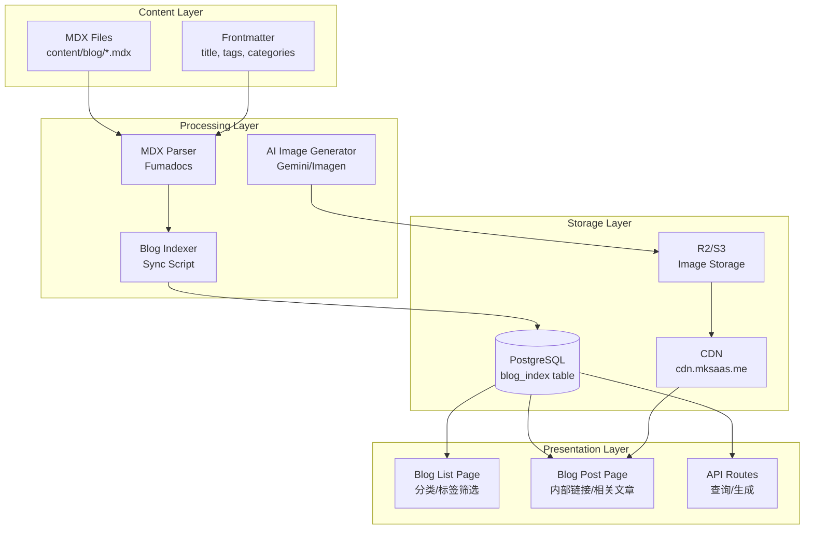

# Design Document: Blog SEO Enhancement

## Overview

本设计文档描述了博客 SEO 增强系统的技术架构和实现方案。系统采用 MDX + 数据库索引的混合架构，在保持内容 Git 版本控制的同时，通过数据库索引支持内部链接、相关文章推荐和动态查询功能。

### 核心设计原则

1. **内容即代码**: MDX 文件作为单一内容源，通过 Git 进行版本控制
2. **索引即缓存**: 数据库索引作为 MDX 内容的查询缓存，支持快速检索
3. **渐进增强**: 新功能不破坏现有博客系统，可逐步启用
4. **平台兼容**: 设计兼容 mk-saas 平台，支持未来迁移

## Architecture



## Components and Interfaces

### 1. 数据库 Schema 扩展

```typescript
// src/db/schema.ts - 新增 blog_index 表

export const blogIndex = pgTable("blog_index", {
  id: text("id").primaryKey(), // slug 作为主键
  slug: text("slug").notNull().unique(),
  locale: text("locale").notNull().default('en'), // 'en' | 'zh'
  title: text("title").notNull(),
  description: text("description"),
  image: text("image"), // 封面图 URL
  date: timestamp("date").notNull(),
  published: boolean("published").notNull().default(true),
  premium: boolean("premium").default(false),

  // 分类和标签
  categories: text("categories").array().notNull().default([]),
  tags: text("tags").array().default([]),

  // SEO 相关
  seoKeywords: text("seo_keywords").array().default([]),

  // 内部链接
  internalLinks: text("internal_links").array().default([]), // 引用的其他文章 slug
  backlinks: text("backlinks").array().default([]), // 被哪些文章引用

  // 相关文章
  relatedPosts: text("related_posts").array().default([]), // 手动指定

  // 作者
  author: text("author").notNull(),

  // 统计
  viewCount: integer("view_count").default(0),

  // 元数据
  filePath: text("file_path").notNull(), // MDX 文件路径
  contentHash: text("content_hash"), // 内容哈希，用于检测变更

  createdAt: timestamp("created_at").defaultNow(),
  updatedAt: timestamp("updated_at").defaultNow(),
}, (table) => ({
  blogIndexSlugIdx: index("blog_index_slug_idx").on(table.slug),
  blogIndexLocaleIdx: index("blog_index_locale_idx").on(table.locale),
  blogIndexDateIdx: index("blog_index_date_idx").on(table.date),
  blogIndexPublishedIdx: index("blog_index_published_idx").on(table.published),
  blogIndexAuthorIdx: index("blog_index_author_idx").on(table.author),
}));

// 标签表 - 用于标签统计和管理
export const blogTag = pgTable("blog_tag", {
  id: text("id").primaryKey(),
  name: text("name").notNull().unique(),
  slug: text("slug").notNull().unique(),
  description: text("description"),
  postCount: integer("post_count").default(0),
  createdAt: timestamp("created_at").defaultNow(),
}, (table) => ({
  blogTagSlugIdx: index("blog_tag_slug_idx").on(table.slug),
}));
```

### 2. Frontmatter Schema 扩展

```typescript
// source.config.ts - 扩展 blog schema

export const blog = defineCollections({
  type: 'doc',
  dir: 'content/blog',
  schema: frontmatterSchema.extend({
    image: z.string(),
    date: z.string().date(),
    published: z.boolean().default(true),
    premium: z.boolean().optional(),
    categories: z.array(z.string()),
    author: z.string(),

    // 新增字段
    tags: z.array(z.string()).optional().default([]),
    relatedPosts: z.array(z.string()).optional().default([]), // slug 数组
    seoKeywords: z.array(z.string()).optional().default([]),
  }),
});
```

### 3. 博客索引同步服务

```typescript
// src/lib/blog/indexer.ts

interface BlogIndexEntry {
  slug: string;
  locale: string;
  title: string;
  description?: string;
  image: string;
  date: Date;
  published: boolean;
  premium?: boolean;
  categories: string[];
  tags: string[];
  seoKeywords: string[];
  internalLinks: string[];
  relatedPosts: string[];
  author: string;
  filePath: string;
  contentHash: string;
}

interface BlogIndexer {
  // 同步所有博客文章到数据库
  syncAll(): Promise<SyncResult>;

  // 同步单篇文章
  syncOne(filePath: string): Promise<void>;

  // 删除索引
  removeIndex(slug: string): Promise<void>;

  // 解析 MDX 文件中的内部链接
  parseInternalLinks(content: string): string[];

  // 更新反向链接
  updateBacklinks(): Promise<void>;
}

interface SyncResult {
  total: number;
  created: number;
  updated: number;
  deleted: number;
  errors: Array<{ file: string; error: string }>;
}
```

### 4. 内部链接解析器

```typescript
// src/lib/blog/internal-link-parser.ts

// 支持的内部链接语法:
// [[slug]] - 简单链接
// [[slug|显示文本]] - 带自定义文本的链接
// [显示文本](/blog/slug) - 标准 Markdown 链接

interface InternalLinkParser {
  // 解析内容中的内部链接
  parse(content: string): InternalLink[];

  // 将内部链接语法转换为 React 组件
  transform(content: string): string;

  // 验证链接目标是否存在
  validate(links: string[]): Promise<ValidationResult>;
}

interface InternalLink {
  slug: string;
  displayText?: string;
  position: { start: number; end: number };
}

interface ValidationResult {
  valid: string[];
  invalid: string[];
}
```

### 5. AI 图片生成服务

```typescript
// src/lib/blog/image-generator.ts

interface ImageGeneratorConfig {
  provider: 'gemini' | 'imagen' | 'replicate';
  coverSize: { width: 1200; height: 630 };
  contentSize: { width: 800; height: 600 };
  maxCoverSize: 200 * 1024; // 200KB
  maxContentSize: 150 * 1024; // 150KB
  style: 'modern' | 'minimal' | 'vibrant';
}

interface ImageGenerator {
  // 生成封面图
  generateCover(params: {
    title: string;
    description?: string;
    category?: string;
  }): Promise<GeneratedImage>;

  // 生成内容图
  generateContent(params: {
    prompt: string;
    context?: string;
  }): Promise<GeneratedImage>;

  // 批量生成
  generateBatch(requests: ImageRequest[]): Promise<GeneratedImage[]>;

  // 压缩图片到目标大小
  compress(image: Buffer, maxSize: number): Promise<Buffer>;

  // 上传到存储
  upload(image: Buffer, path: string): Promise<string>;
}

interface GeneratedImage {
  url: string;
  width: number;
  height: number;
  size: number;
  format: 'png' | 'webp' | 'jpg';
}
```

### 6. 博客查询服务

```typescript
// src/lib/blog/query-service.ts

interface BlogQueryService {
  // 获取博客列表（支持筛选和分页）
  list(params: {
    locale?: string;
    category?: string;
    tag?: string;
    page?: number;
    pageSize?: number;
    published?: boolean;
  }): Promise<PaginatedResult<BlogIndexEntry>>;

  // 获取单篇文章
  getBySlug(slug: string, locale?: string): Promise<BlogIndexEntry | null>;

  // 获取相关文章
  getRelated(slug: string, limit?: number): Promise<BlogIndexEntry[]>;

  // 获取所有分类及文章数
  getCategories(locale?: string): Promise<CategoryWithCount[]>;

  // 获取所有标签及文章数
  getTags(locale?: string): Promise<TagWithCount[]>;

  // 搜索文章
  search(query: string, locale?: string): Promise<BlogIndexEntry[]>;
}

interface PaginatedResult<T> {
  items: T[];
  total: number;
  page: number;
  pageSize: number;
  totalPages: number;
}

interface CategoryWithCount {
  slug: string;
  name: string;
  count: number;
}

interface TagWithCount {
  slug: string;
  name: string;
  count: number;
}
```

### 7. 迁移工具

```typescript
// scripts/migrate-blogs.ts

interface MigrationConfig {
  sourceDir: string; // 备份目录
  targetDir: string; // content/blog
  categoryMapping: Record<string, string>; // 分类映射
  defaultAuthor: string;
  dryRun: boolean;
}

interface MigrationResult {
  total: number;
  success: string[];
  failed: Array<{ file: string; reason: string }>;
  needsCoverImage: string[];
  report: string;
}

interface BlogMigrator {
  // 执行迁移
  migrate(config: MigrationConfig): Promise<MigrationResult>;

  // 验证 Frontmatter
  validateFrontmatter(content: string): ValidationResult;

  // 补全缺失字段
  completeFrontmatter(content: string, defaults: Partial<Frontmatter>): string;

  // 生成迁移报告
  generateReport(result: MigrationResult): string;
}
```

## Data Models

### 博客文章完整数据模型

```typescript
interface BlogPost {
  // 基础信息
  slug: string;
  locale: 'en' | 'zh';
  title: string;
  description?: string;

  // 内容
  content: string; // MDX 内容
  excerpt?: string; // 摘要

  // 媒体
  image: string; // 封面图 URL
  images?: string[]; // 内容图 URL 列表

  // 分类
  categories: string[];
  tags: string[];

  // SEO
  seoKeywords?: string[];
  canonicalUrl?: string;

  // 链接
  internalLinks: string[]; // 引用的文章
  backlinks: string[]; // 被引用
  relatedPosts: string[]; // 相关文章

  // 作者
  author: {
    id: string;
    name: string;
    avatar: string;
  };

  // 时间
  date: Date;
  updatedAt?: Date;

  // 状态
  published: boolean;
  premium?: boolean;

  // 统计
  viewCount: number;
  readingTime: number; // 分钟
}
```

### 图片资源模型

```typescript
interface BlogImage {
  id: string;
  type: 'cover' | 'content';
  url: string;
  cdnUrl: string;
  width: number;
  height: number;
  size: number;
  format: 'png' | 'webp' | 'jpg';
  alt?: string;
  blogSlug: string;
  generatedBy?: 'ai' | 'manual';
  prompt?: string; // AI 生成时的 prompt
  createdAt: Date;
}
```

## Correctness Properties

*A property is a characteristic or behavior that should hold true across all valid executions of a system-essentially, a formal statement about what the system should do. Properties serve as the bridge between human-readable specifications and machine-verifiable correctness guarantees.*

### Property 1: 索引同步一致性
*For any* MDX 博客文件，当文件被创建或更新后执行同步，数据库中的索引记录应与文件的 Frontmatter 内容完全一致。
**Validates: Requirements 1.1, 1.2**

### Property 2: 索引删除一致性
*For any* 已索引的博客文章，当对应的 MDX 文件被删除后，数据库中不应存在该文章的索引记录。
**Validates: Requirements 1.3**

### Property 3: Frontmatter Schema 验证
*For any* 包含 tags、relatedPosts 或 seoKeywords 字段的 Frontmatter，解析后应正确提取这些字段的值。
**Validates: Requirements 2.1, 2.2, 2.3**

### Property 4: Frontmatter 必填字段验证
*For any* 缺少必填字段（title, image, date, categories, author）的 Frontmatter，验证函数应返回错误。
**Validates: Requirements 2.4**

### Property 5: 内部链接解析
*For any* 包含内部链接语法（[[slug]] 或 [[slug|text]]）的 MDX 内容，解析器应正确提取所有链接的 slug 和显示文本。
**Validates: Requirements 3.1**

### Property 6: 封面图尺寸约束
*For any* 生成的封面图，其尺寸应为 1200x630 像素，文件大小应小于 200KB。
**Validates: Requirements 4.1, 4.2**

### Property 7: 内容图尺寸约束
*For any* 生成的内容图，其宽度应在 800-1000 像素范围内，文件大小应小于 150KB。
**Validates: Requirements 5.1, 5.2**

### Property 8: 内容图 MDX 语法
*For any* 生成的内容图，返回的引用语法应符合 MDX 图片语法格式。
**Validates: Requirements 5.3**

### Property 9: 分类筛选准确性
*For any* 分类筛选查询，返回的所有文章都应属于指定的分类。
**Validates: Requirements 6.2**

### Property 10: 标签筛选准确性
*For any* 标签筛选查询，返回的所有文章都应包含指定的标签。
**Validates: Requirements 6.3**

### Property 11: 组合筛选准确性
*For any* 同时指定分类和标签的筛选查询，返回的所有文章都应同时满足分类和标签条件。
**Validates: Requirements 6.4**

### Property 12: 分类/标签计数准确性
*For any* 分类或标签，其显示的文章数量应等于实际属于该分类或包含该标签的已发布文章数量。
**Validates: Requirements 6.5**

### Property 13: 迁移 Frontmatter 验证
*For any* 迁移的文章，迁移后的 Frontmatter 应包含所有必填字段。
**Validates: Requirements 7.2**

### Property 14: 迁移分类映射
*For any* 迁移的文章，其分类应根据映射表正确转换。
**Validates: Requirements 7.3**

### Property 15: 缺失封面图标记
*For any* 迁移的文章，如果原文章缺少封面图，迁移结果中应标记该文章需要生成封面图。
**Validates: Requirements 7.5**

### Property 16: 分页触发条件
*For any* 博客列表查询，当文章总数超过每页限制时，应返回分页信息。
**Validates: Requirements 8.1**

### Property 17: 分页状态保持
*For any* 带有分类或标签筛选的分页查询，切换页码后筛选条件应保持不变。
**Validates: Requirements 8.3**

### Property 18: URL 页码解析
*For any* 包含页码参数的 URL，查询应返回对应页的内容。
**Validates: Requirements 8.4**

### Property 19: OG 元标签完整性
*For any* 博客文章页面，渲染结果应包含完整的 Open Graph 元标签（og:title, og:description, og:image, og:url）。
**Validates: Requirements 9.1**

### Property 20: Sitemap 完整性
*For any* 已发布的博客文章，sitemap.xml 中应包含该文章的 URL。
**Validates: Requirements 9.2**

### Property 21: JSON-LD 结构化数据
*For any* 博客文章页面，渲染结果应包含符合 Article schema 的 JSON-LD 数据。
**Validates: Requirements 9.3**

### Property 22: SEO Keywords 元标签
*For any* 包含 seoKeywords 的博客文章，页面应包含对应的 meta keywords 标签。
**Validates: Requirements 9.4**

### Property 23: CDN 路径格式
*For any* 上传的图片资源，其 URL 应符合统一的 CDN 路径格式（cdn.mksaas.me/images/blog/...）。
**Validates: Requirements 10.2**

### Property 24: JSON 导出格式
*For any* 博客数据导出，输出应为有效的 JSON 格式，且包含所有必需字段。
**Validates: Requirements 10.4**

## Error Handling

### 索引同步错误

| 错误类型 | 处理策略 |
|---------|---------|
| MDX 解析失败 | 记录错误日志，跳过该文件，继续处理其他文件 |
| Frontmatter 验证失败 | 记录详细错误信息，标记文件需要修复 |
| 数据库连接失败 | 重试 3 次，失败后抛出异常终止同步 |
| 内容哈希计算失败 | 使用文件修改时间作为备选 |

### 图片生成错误

| 错误类型 | 处理策略 |
|---------|---------|
| AI API 调用失败 | 重试 2 次，失败后使用默认占位图 |
| 图片压缩失败 | 降低质量参数重试，最终使用原图 |
| 上传失败 | 重试 3 次，失败后保存到本地备份 |
| 超出 API 限流 | 加入队列延迟处理 |

### 查询错误

| 错误类型 | 处理策略 |
|---------|---------|
| 数据库查询超时 | 返回缓存数据或空结果 |
| 无效的筛选参数 | 忽略无效参数，使用默认值 |
| 分页参数越界 | 返回最后一页或第一页 |

## Testing Strategy

### 单元测试

使用 Vitest 进行单元测试，覆盖以下模块：

1. **Frontmatter 解析器**: 测试各种 Frontmatter 格式的解析
2. **内部链接解析器**: 测试链接语法的识别和提取
3. **图片压缩工具**: 测试不同尺寸和格式的压缩
4. **查询服务**: 测试筛选、分页、排序逻辑

### 属性测试

使用 fast-check 进行属性测试，验证以下属性：

1. **索引同步一致性** (Property 1, 2)
2. **Frontmatter 验证** (Property 3, 4)
3. **内部链接解析** (Property 5)
4. **图片尺寸约束** (Property 6, 7)
5. **筛选准确性** (Property 9, 10, 11, 12)
6. **分页逻辑** (Property 16, 17, 18)
7. **SEO 元标签** (Property 19, 21, 22)

### 集成测试

1. **端到端同步流程**: MDX 文件变更 → 索引更新 → 查询验证
2. **图片生成流程**: 请求生成 → AI 调用 → 压缩 → 上传 → URL 返回
3. **迁移流程**: 源文件读取 → 验证 → 转换 → 写入 → 报告生成

### 测试配置

```typescript
// vitest.config.ts 中的属性测试配置
export default defineConfig({
  test: {
    // 属性测试运行 100 次迭代
    fuzz: {
      iterations: 100,
    },
  },
});
```
