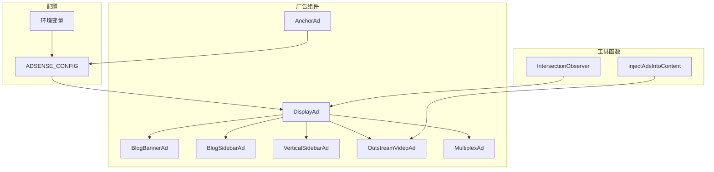
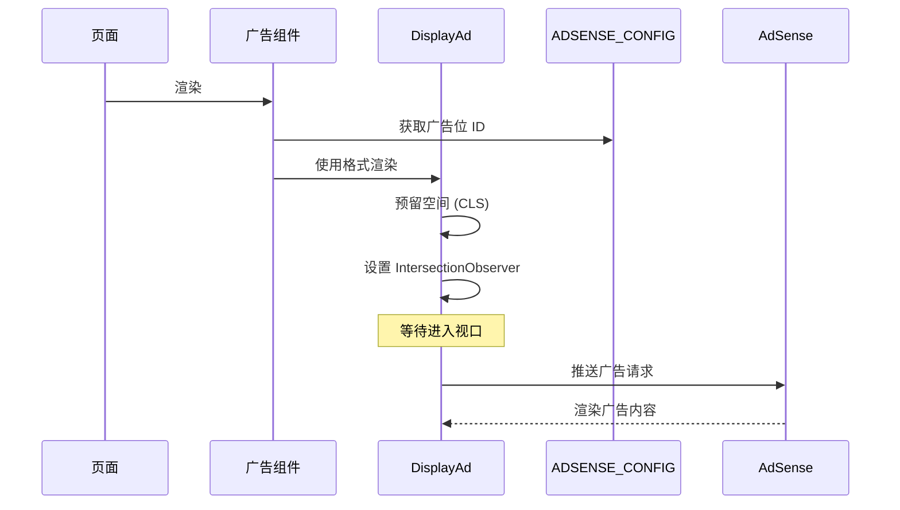

# 功能设计：广告系统增强

## 概述

本设计扩展现有的 AdSense 广告系统，以支持高收益广告格式（垂直广告、外播视频广告、多重推荐广告、锚定广告）和文章内容的自动广告注入。系统在添加新功能的同时保持与现有组件的向后兼容性。

### 关键设计决策

1. **扩展现有 DisplayAd**：向现有组件添加新格式，而不是创建单独的实现
2. **AnchorAd 作为独立组件**：由于独特的交互模式，单独实现锚定广告（见下方架构决策记录）
3. **配置驱动**：所有广告位通过集中的 ADSENSE_CONFIG 管理
4. **CLS 优先**：所有广告格式都有预定义的最小尺寸以防止布局偏移
5. **懒加载**：所有广告使用 IntersectionObserver 进行性能优化

## 架构决策记录：AnchorAd 独立性

### 背景

锚定广告格式具有与其他广告类型显著不同的独特需求：
- 固定定位在视口底部（在文档流之外）
- 用户交互（带有会话持久性的关闭按钮）
- 不需要懒加载（始终可见）
- 不需要 CLS 预防（不影响布局）

### 决策

**将 AnchorAd 实现为独立组件，不使用 DisplayAd。**

### 理由

1. **交互模型**
   - DisplayAd：仅被动展示
   - AnchorAd：主动用户交互（关闭按钮 + sessionStorage）

2. **布局模型**
   - DisplayAd：在文档流中，需要空间预留
   - AnchorAd：固定定位，无布局影响

3. **生命周期管理**
   - DisplayAd：组件作用域状态
   - AnchorAd：会话作用域持久性

4. **代码清晰度**
   - 复用 DisplayAd 需要大量条件逻辑
   - 独立实现使两个组件都保持专注和可维护

### 后果

**正面**：
- 清晰的关注点分离
- 更容易独立维护和演进
- DisplayAd 中没有复杂的条件逻辑
- 更好的性能（没有不必要的懒加载逻辑）

**负面**：
- 一些代码重复（AdSense push 逻辑、测试模式渲染）
- 需要维护两个组件而不是一个

**缓解措施**：
- 代码重复很少（约 30 行）
- 如果需要，可以将共享逻辑提取到自定义 hooks 中（例如 `useAdsensePush`）

### 状态

**已接受** - 已在生产环境中实现

---

## 架构



### 数据流



## 组件和接口

### DisplayAd（扩展）

```typescript
type AdFormat = 'horizontal' | 'rectangle' | 'vertical' | 'outstream' | 'multiplex' | 'anchor';

interface DisplayAdProps {
  slot: string;
  format?: AdFormat;
  className?: string;
  lazy?: boolean;
}

const formatDimensions: Record<AdFormat, { minHeight: number; minWidth?: number; aspectRatio?: string }> = {
  horizontal: { minHeight: 90 },
  rectangle: { minHeight: 250, minWidth: 300 },
  vertical: { minHeight: 600, minWidth: 300 },
  outstream: { minHeight: 250, aspectRatio: '16/9' },
  multiplex: { minHeight: 280 },
  anchor: { minHeight: 50, maxHeight: 100 },
};
```

### 新预设组件

```typescript
// VerticalSidebarAd - 300×600 摩天大楼广告
function VerticalSidebarAd({ className }: { className?: string }): JSX.Element | null;

// OutstreamVideoAd - 文章内视频广告
function OutstreamVideoAd({ className }: { className?: string }): JSX.Element | null;

// MultiplexAd - 推荐样式广告
function MultiplexAd({ className }: { className?: string }): JSX.Element | null;

// AnchorAd - 粘性底部广告
function AnchorAd(): JSX.Element | null;
```

### 广告注入工具

```typescript
interface InjectAdsOptions {
  minParagraphs: number;      // 注入所需的最小段落数（默认：5）
  firstAdAfter: number;       // 第一个广告位置（默认：2）
  adInterval: number;         // 广告之间的段落间隔（默认：4）
  maxAds: number;             // 最大注入广告数（默认：2）
}

function injectAdsIntoContent(
  children: React.ReactNode,
  options?: Partial<InjectAdsOptions>
): React.ReactNode;
```

## 数据模型

### ADSENSE_CONFIG（扩展）

```typescript
interface AdsenseConfig {
  publisherId: string;
  enabled: boolean;
  testMode: boolean;
  slots: {
    blogBanner: string;
    blogSidebar: string;
    homeBanner: string;
    vertical: string;      // 新增
    outstream: string;     // 新增
    multiplex: string;     // 新增
    anchor: string;        // 新增
  };
}
```

### 环境变量

```bash
NEXT_PUBLIC_ADSENSE_ENABLED=true
NEXT_PUBLIC_ADSENSE_PUBLISHER_ID=ca-pub-XXXXXXXX
NEXT_PUBLIC_ADSENSE_BLOG_BANNER=slot-id
NEXT_PUBLIC_ADSENSE_BLOG_SIDEBAR=slot-id
NEXT_PUBLIC_ADSENSE_HOME_BANNER=slot-id
NEXT_PUBLIC_ADSENSE_VERTICAL=slot-id
NEXT_PUBLIC_ADSENSE_OUTSTREAM=slot-id
NEXT_PUBLIC_ADSENSE_MULTIPLEX=slot-id
NEXT_PUBLIC_ADSENSE_ANCHOR=slot-id
```

## 正确性属性

### 前期分析

```
1.1 广告系统应支持尺寸为 300×600 像素的 `vertical` 格式
  思考：我们可以验证格式存在且 formatDimensions 中的尺寸正确
  可测试：是 - 属性

1.2 当渲染 VerticalSidebarAd 组件时，广告系统应预留最小 600px 高度
  思考：我们可以检查渲染元素的 minHeight 样式
  可测试：是 - 属性

1.3 当广告进入视口时，广告系统应触发广告加载
  思考：这涉及 IntersectionObserver 行为，可以用 mock 测试
  可测试：是 - 示例

1.4 在开发模式下，广告系统应显示占位符
  思考：我们可以验证当 testMode 为 true 时的占位符渲染
  可测试：是 - 属性

1.5 如果 ADSENSE_CONFIG.enabled 为 false，则广告系统应不渲染任何内容
  思考：我们可以验证禁用时返回 null
  可测试：是 - 属性

2.1 广告系统应支持 `outstream` 格式
  思考：验证格式存在于 formatDimensions 中
  可测试：是 - 属性

2.4 广告系统应预留最小 250px 高度和 16:9 宽高比
  思考：验证 formatDimensions 中的尺寸
  可测试：是 - 属性

4.3 AnchorAd 应包含一个可见的关闭按钮
  思考：UI 元素存在性测试
  可测试：是 - 示例

4.6 如果用户已关闭锚定广告，则广告系统不应再次显示
  思考：会话状态持久性，可以用 mock sessionStorage 测试
  可测试：是 - 属性

5.1 ADSENSE_CONFIG 应包含所有广告类型的广告位 ID
  思考：配置结构验证
  可测试：是 - 属性

5.2 当广告组件在没有有效广告位 ID 的情况下渲染时，广告系统应不渲染任何内容
  思考：空广告位处理
  可测试：是 - 属性

7.1 当文章有 5 个或更多段落时，广告系统应注入一个广告
  思考：计算段落数并验证注入
  可测试：是 - 属性

7.2 当文章有 10 个或更多段落时，广告系统应注入第二个广告
  思考：计算段落数并验证两次注入
  可测试：是 - 属性

7.3 广告系统每篇文章最多注入 2 个广告
  思考：无论段落数如何，验证最大限制
  可测试：是 - 属性

7.4 如果文章少于 5 个段落，则广告系统不应注入任何广告
  思考：验证短文章不注入
  可测试：是 - 属性
```

### 属性反思

分析后，属性可以分组：
- 属性 1.1、2.1、2.4 与格式尺寸相关 - 合并为一个
- 属性 1.5、5.2 与禁用/空状态相关 - 合并
- 属性 7.1-7.4 与广告注入规则相关 - 作为综合属性测试

### 属性

**属性 1：格式尺寸正确定义**

*对于任何*支持的广告格式（horizontal、rectangle、vertical、outstream、multiplex、anchor），formatDimensions 对象应包含有效的 minHeight（正整数）和可选的 minWidth/aspectRatio 值。

**验证：需求 1.1、2.1、2.4、3.3、4.5**

---

**属性 2：禁用状态不渲染任何内容**

*对于任何*广告组件，当 ADSENSE_CONFIG.enabled 为 false 且 testMode 为 false 时，组件应返回 null。

**验证：需求 1.5、5.2**

---

**属性 3：测试模式渲染占位符**

*对于任何*广告组件和格式，当 testMode 为 true 时，组件应渲染带有格式标签和尺寸的占位符 div，而不是实际广告。

**验证：需求 1.4、2.5**

---

**属性 4：通过预留空间防止 CLS**

*对于任何*具有有效格式的广告组件，渲染的容器应具有与 formatDimensions[format].minHeight 匹配的 minHeight 样式。

**验证：需求 1.2、2.4、3.3、4.5**

---

**属性 5：配置完整性**

*对于任何*预期的广告位键（blogBanner、blogSidebar、homeBanner、vertical、outstream、multiplex、anchor），ADSENSE_CONFIG.slots 应包含该键及字符串值。

**验证：需求 5.1、5.3、5.4**

---

**属性 6：广告注入遵守段落数规则**

*对于任何*包含 N 个段落元素的 React children 数组：
- 如果 N < 5：注入 0 个广告
- 如果 5 <= N < 10：在第 2-3 段后注入 1 个广告
- 如果 N >= 10：注入 2 个广告，间隔至少 4 个段落
- 永远不注入超过 2 个广告

**验证：需求 7.1、7.2、7.3、7.4**

---

**属性 7：锚定广告关闭持久性**

*对于任何* AnchorAd 组件，在点击关闭按钮后，同一会话内的后续渲染应返回 null。

**验证：需求 4.4、4.6**

---

**属性 8：空广告位在生产环境不渲染任何内容**

*对于任何*具有空字符串广告位 ID 的广告组件，当 testMode 为 false 且 enabled 为 true 时，组件应返回 null。

**验证：需求 5.2**

## 错误处理

### 错误类型

| 错误条件 | 处理方式 |
|----------|----------|
| 缺少广告位 ID | 返回 null，无错误 |
| AdSense 脚本未加载 | 捕获错误，记录警告 |
| 无效格式 | TypeScript 编译错误 |
| 不支持 IntersectionObserver | 回退到立即加载 |

### 优雅降级

```typescript
// 如果不支持 IntersectionObserver
if (typeof IntersectionObserver === 'undefined') {
  setIsVisible(true); // 立即加载
  return;
}
```

## 测试策略

### 基于属性的测试框架

**选定框架**：fast-check（TypeScript）

### 测试配置

- 每个属性最少迭代 100 次
- 记录种子以便复现

### 单元测试

- 格式尺寸验证
- 组件渲染状态（enabled/disabled/testMode）
- 锚定广告关闭行为
- 广告注入逻辑

### 属性测试

```typescript
// **功能：ad-system，属性 1：格式尺寸正确定义**
test.prop([fc.constantFrom('horizontal', 'rectangle', 'vertical', 'outstream', 'multiplex', 'anchor')])
('所有格式都有有效尺寸', (format) => {
  const dims = formatDimensions[format];
  expect(dims.minHeight).toBeGreaterThan(0);
  if (dims.minWidth) expect(dims.minWidth).toBeGreaterThan(0);
});

// **功能：ad-system，属性 6：广告注入遵守段落数规则**
test.prop([fc.integer({ min: 0, max: 20 })])
('广告注入遵循段落规则', (paragraphCount) => {
  const children = Array(paragraphCount).fill(null).map((_, i) => <p key={i}>内容</p>);
  const result = injectAdsIntoContent(children);
  const adCount = countAdsInChildren(result);

  if (paragraphCount < 5) expect(adCount).toBe(0);
  else if (paragraphCount < 10) expect(adCount).toBe(1);
  else expect(adCount).toBe(2);
});
```

### 测试组织

```
tests/
├── unit/
│   ├── display-ad.test.tsx
│   ├── anchor-ad.test.tsx
│   └── adsense-config.test.ts
└── properties/
    ├── format-dimensions.prop.ts
    ├── ad-injection.prop.ts
    └── component-states.prop.ts
```
