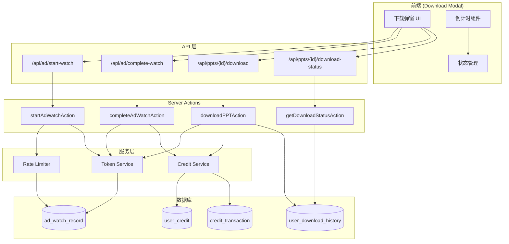
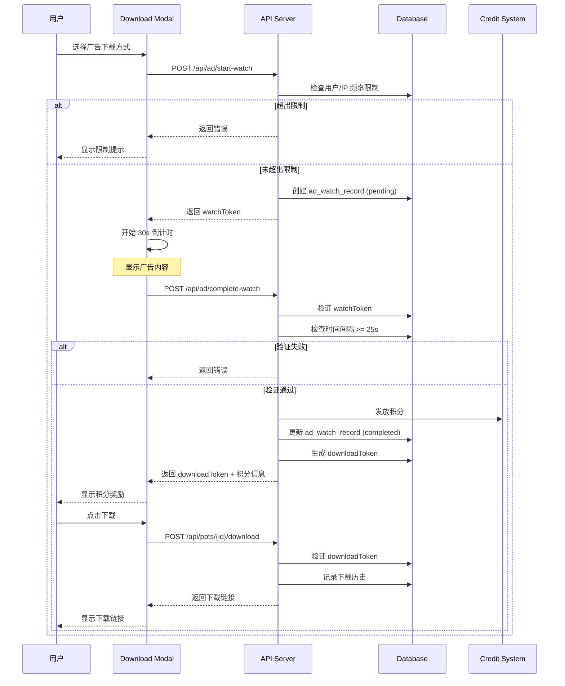

# Design Document: Download Ad Optimization

## Overview

本设计文档描述了 PPT 下载组件广告优化功能的技术实现方案。该功能将当前的 Mock 广告实现升级为生产级功能，实现广告观看 → 积分奖励 → 下载解锁的完整流程，并添加后端验证和防刷机制保护系统安全。

### 核心目标

1. **广告观看验证**: 通过 Watch_Token 和 Download_Token 双令牌机制验证广告观看
2. **积分奖励**: 观看广告后自动发放积分奖励
3. **下载方式验证**: 支持首次免费、积分下载、广告下载三种方式
4. **防刷机制**: 通过用户/IP 频率限制和时间验证防止滥用

## Architecture

### 系统架构图



### 广告观看流程



## Components and Interfaces

### API 接口设计

#### 1. POST /api/ad/start-watch

开始广告观看，生成 Watch_Token。

**请求体**:
```typescript
interface StartWatchRequest {
  pptId: string;  // 要下载的 PPT ID
}
```

**响应体**:
```typescript
interface StartWatchResponse {
  success: boolean;
  data?: {
    watchToken: string;    // 观看令牌
    duration: number;      // 需要观看的秒数 (30)
    expiresAt: string;     // 令牌过期时间 (ISO 8601)
  };
  error?: string;
}
```

#### 2. POST /api/ad/complete-watch

完成广告观看，验证并发放积分。

**请求体**:
```typescript
interface CompleteWatchRequest {
  watchToken: string;
  pptId: string;
}
```

**响应体**:
```typescript
interface CompleteWatchResponse {
  success: boolean;
  data?: {
    downloadToken: string;  // 下载令牌
    creditsAwarded: number; // 获得的积分
    newBalance: number;     // 新积分余额
  };
  error?: string;
}
```

#### 3. POST /api/ppts/{id}/download (修改)

生成下载链接，支持多种下载方式。

**请求体**:
```typescript
interface DownloadRequest {
  method: 'firstFree' | 'credits' | 'ad';
  downloadToken?: string;  // ad 方式必需
}
```

**响应体**:
```typescript
interface DownloadResponse {
  success: boolean;
  data?: {
    fileUrl: string;
    expiresAt: string;
  };
  error?: string;
}
```

#### 4. GET /api/ppts/{id}/download-status

查询用户下载状态。

**响应体**:
```typescript
interface DownloadStatusResponse {
  success: boolean;
  data?: {
    pptId: string;
    hasDownloadedBefore: boolean;
    isFirstDownloadAvailable: boolean;
    creditBalance: number;
    requiredCredits: number;
  };
  error?: string;
}
```

### 服务层接口

#### Rate Limiter Service

```typescript
interface RateLimiterService {
  // 检查用户是否可以观看广告
  checkUserLimit(userId: string): Promise<RateLimitResult>;

  // 检查 IP 是否可以观看广告
  checkIPLimit(ip: string): Promise<RateLimitResult>;

  // 获取用户今日观看次数
  getUserWatchCount(userId: string): Promise<number>;

  // 获取 IP 今日观看次数
  getIPWatchCount(ip: string): Promise<number>;
}

interface RateLimitResult {
  allowed: boolean;
  reason?: string;
  remainingCount?: number;
}
```

#### Token Service

```typescript
interface TokenService {
  // 生成观看令牌
  generateWatchToken(userId: string, pptId: string, ip: string): Promise<string>;

  // 验证观看令牌
  validateWatchToken(token: string): Promise<WatchTokenValidation>;

  // 完成观看并生成下载令牌
  completeWatch(token: string): Promise<CompleteWatchResult>;

  // 验证下载令牌
  validateDownloadToken(token: string): Promise<DownloadTokenValidation>;

  // 消费下载令牌
  consumeDownloadToken(token: string): Promise<void>;
}

interface WatchTokenValidation {
  valid: boolean;
  error?: 'NOT_FOUND' | 'EXPIRED' | 'ALREADY_USED' | 'TIME_NOT_ELAPSED';
  record?: AdWatchRecord;
}
```

## Data Models

### 数据库表结构

#### ad_watch_record (已存在)

```typescript
// src/db/schema.ts
export const adWatchRecord = pgTable("ad_watch_record", {
  id: text("id").primaryKey(),
  userId: text("user_id").references(() => user.id, { onDelete: 'cascade' }),
  ipAddress: text("ip_address"),
  pptId: text("ppt_id"),
  watchToken: text("watch_token").unique().notNull(),
  downloadToken: text("download_token"),
  startedAt: timestamp("started_at").notNull().defaultNow(),
  completedAt: timestamp("completed_at"),
  status: text("status").notNull().default('pending'), // pending, completed, expired
  creditsAwarded: integer("credits_awarded").default(0),
  createdAt: timestamp("created_at").notNull().defaultNow(),
});
```

#### user_download_history (已存在)

```typescript
export const userDownloadHistory = pgTable("user_download_history", {
  id: text("id").primaryKey(),
  userId: text("user_id").references(() => user.id, { onDelete: 'cascade' }),
  pptId: text("ppt_id").notNull(),
  downloadMethod: text("download_method").notNull(), // firstFree, credits, ad
  creditsSpent: integer("credits_spent").default(0),
  ipAddress: text("ip_address"),
  downloadedAt: timestamp("downloaded_at").notNull().defaultNow(),
});
```

### 配置数据模型

```typescript
// src/config/website.tsx 新增配置
interface AdRewardConfig {
  enable: boolean;           // 是否启用广告奖励
  creditsPerWatch: number;   // 每次观看获得积分
  watchDuration: number;     // 观看时长 (秒)
  minWatchDuration: number;  // 最小验证时长 (秒)
  tokenExpireMinutes: number; // 令牌过期时间 (分钟)
  dailyLimitPerUser: number; // 每用户每日限制
  dailyLimitPerIP: number;   // 每 IP 每日限制
}

// 默认配置
const defaultAdRewardConfig: AdRewardConfig = {
  enable: true,
  creditsPerWatch: 5,
  watchDuration: 30,
  minWatchDuration: 25,
  tokenExpireMinutes: 5,
  dailyLimitPerUser: 10,
  dailyLimitPerIP: 20,
};
```


## Correctness Properties

*A property is a characteristic or behavior that should hold true across all valid executions of a system-essentially, a formal statement about what the system should do. Properties serve as the bridge between human-readable specifications and machine-verifiable correctness guarantees.*

Based on the prework analysis, the following correctness properties have been identified for property-based testing:

### Property 1: Watch Token Generation Produces Unique Pending Records

*For any* valid user and PPT combination, when a watch token is generated, the system SHALL create a unique token with pending status and a 5-minute expiration time stored in the ad_watch_record table.

**Validates: Requirements 1.1, 1.2, 1.5**

### Property 2: Rate Limiting Enforces Daily Limits

*For any* user who has completed N ad watches today (where N >= dailyLimitPerUser), subsequent start-watch requests SHALL be rejected. Similarly, *for any* IP address that has completed M ad watches today (where M >= dailyLimitPerIP), subsequent start-watch requests SHALL be rejected.

**Validates: Requirements 1.3, 1.4, 5.1, 5.2**

### Property 3: Time Validation Enforces Minimum Watch Duration

*For any* watch token submission, if the elapsed time since token creation is less than minWatchDuration (25 seconds), the completion request SHALL be rejected. If the elapsed time is >= minWatchDuration, the time validation SHALL pass.

**Validates: Requirements 2.2, 5.3**

### Property 4: Token Lifecycle State Transitions

*For any* watch token, the following state transitions SHALL be enforced:
- A token starts in 'pending' status
- A token can transition from 'pending' to 'completed' (on successful completion)
- A token can transition from 'pending' to 'expired' (after expiration time)
- A token in 'completed' or 'expired' status SHALL NOT be reusable
- Each token SHALL be usable exactly once

**Validates: Requirements 2.1, 2.4, 2.5, 5.4**

### Property 5: Credit Award Creates Correct Transaction

*For any* successful ad watch completion, the system SHALL:
- Increase the user's credit balance by exactly creditsPerWatch
- Create a credit_transaction record with type AD_REWARD
- The transaction amount SHALL equal creditsPerWatch

**Validates: Requirements 2.3, 2.6, 7.1, 7.2**

### Property 6: Download Method Validation

*For any* download request:
- If method is 'firstFree', the request SHALL succeed only if the user has NOT downloaded this PPT before
- If method is 'credits', the request SHALL succeed only if the user's credit balance >= requiredCredits
- If method is 'ad', the request SHALL succeed only if the downloadToken is valid and unused

**Validates: Requirements 3.1, 3.2, 3.3**

### Property 7: Download History Recording

*For any* successful download (regardless of method), the system SHALL create a record in user_download_history with the correct userId, pptId, downloadMethod, and creditsSpent.

**Validates: Requirements 3.4**

### Property 8: Credit Deduction Creates Correct Transaction

*For any* successful credit-based download, the system SHALL:
- Decrease the user's credit balance by exactly requiredCredits
- Create a credit_transaction record with type USAGE
- The transaction amount SHALL be negative and equal to -requiredCredits

**Validates: Requirements 3.5, 7.4**

### Property 9: Download Status Reflects History

*For any* user and PPT combination:
- If user has no download history for this PPT, isFirstDownloadAvailable SHALL be true
- If user has download history for this PPT, isFirstDownloadAvailable SHALL be false
- The creditBalance returned SHALL equal the user's actual credit balance

**Validates: Requirements 4.1, 4.2, 4.3, 4.4**

### Property 10: Configuration Values Are Respected

*For any* ad watch operation, the system SHALL use the configured values from websiteConfig.adReward for:
- creditsPerWatch (credits awarded)
- watchDuration (countdown duration)
- minWatchDuration (validation threshold)
- dailyLimitPerUser and dailyLimitPerIP (rate limits)

**Validates: Requirements 8.1, 8.2**

## Error Handling

### Error Types

```typescript
enum AdWatchError {
  USER_LIMIT_EXCEEDED = 'USER_LIMIT_EXCEEDED',
  IP_LIMIT_EXCEEDED = 'IP_LIMIT_EXCEEDED',
  TOKEN_NOT_FOUND = 'TOKEN_NOT_FOUND',
  TOKEN_EXPIRED = 'TOKEN_EXPIRED',
  TOKEN_ALREADY_USED = 'TOKEN_ALREADY_USED',
  TIME_NOT_ELAPSED = 'TIME_NOT_ELAPSED',
  INVALID_PPT = 'INVALID_PPT',
  CREDIT_AWARD_FAILED = 'CREDIT_AWARD_FAILED',
}

enum DownloadError {
  FIRST_FREE_NOT_AVAILABLE = 'FIRST_FREE_NOT_AVAILABLE',
  INSUFFICIENT_CREDITS = 'INSUFFICIENT_CREDITS',
  INVALID_DOWNLOAD_TOKEN = 'INVALID_DOWNLOAD_TOKEN',
  DOWNLOAD_TOKEN_USED = 'DOWNLOAD_TOKEN_USED',
  PPT_NOT_FOUND = 'PPT_NOT_FOUND',
  FILE_NOT_FOUND = 'FILE_NOT_FOUND',
}
```

### Error Response Format

```typescript
interface ErrorResponse {
  success: false;
  error: string;
  code: AdWatchError | DownloadError;
  details?: Record<string, unknown>;
}
```

### Error Handling Strategy

1. **Rate Limit Errors**: 返回友好提示，告知用户剩余等待时间
2. **Token Errors**: 清除前端状态，允许用户重新开始
3. **Credit Errors**: 显示当前余额，引导用户获取更多积分
4. **System Errors**: 记录日志，返回通用错误信息

## Testing Strategy

### Property-Based Testing

本项目使用 **fast-check** 作为属性测试库，配合 Vitest 测试框架。

#### 测试配置

```typescript
// vitest.config.ts
export default defineConfig({
  test: {
    // 属性测试运行 100 次迭代
    testTimeout: 30000,
  },
});
```

#### 属性测试文件结构

```
src/
├── actions/
│   └── ad/
│       ├── start-watch.ts
│       ├── start-watch.test.ts        # 单元测试
│       ├── start-watch.property.test.ts  # 属性测试
│       ├── complete-watch.ts
│       ├── complete-watch.test.ts
│       └── complete-watch.property.test.ts
├── lib/
│   └── ad-watch/
│       ├── rate-limiter.ts
│       ├── rate-limiter.test.ts
│       ├── rate-limiter.property.test.ts
│       ├── token-service.ts
│       ├── token-service.test.ts
│       └── token-service.property.test.ts
```

#### 属性测试示例

```typescript
// src/lib/ad-watch/rate-limiter.property.test.ts
import { fc } from '@fast-check/vitest';
import { describe, it, expect } from 'vitest';
import { checkUserLimit, checkIPLimit } from './rate-limiter';

describe('Rate Limiter Properties', () => {
  /**
   * Feature: download-ad-optimization, Property 2: Rate Limiting Enforces Daily Limits
   * Validates: Requirements 1.3, 1.4, 5.1, 5.2
   */
  it.prop([
    fc.integer({ min: 0, max: 20 }), // watchCount
    fc.integer({ min: 1, max: 15 }), // dailyLimit
  ])('should reject when watch count >= daily limit', async (watchCount, dailyLimit) => {
    const result = await checkUserLimit(watchCount, dailyLimit);

    if (watchCount >= dailyLimit) {
      expect(result.allowed).toBe(false);
    } else {
      expect(result.allowed).toBe(true);
    }
  });
});
```

### Unit Testing

单元测试覆盖以下场景：

1. **API 路由测试**: 验证请求/响应格式
2. **Service 测试**: 验证业务逻辑
3. **数据库操作测试**: 验证 CRUD 操作
4. **错误处理测试**: 验证各种错误场景

### Integration Testing

集成测试覆盖完整流程：

1. **广告观看完整流程**: start-watch → countdown → complete-watch → download
2. **积分系统集成**: 验证积分发放和扣除
3. **防刷机制**: 验证频率限制生效

### Test Data Generators

```typescript
// src/test/generators/ad-watch.ts
import { fc } from '@fast-check/vitest';

export const userIdArb = fc.uuid();
export const pptIdArb = fc.uuid();
export const ipAddressArb = fc.ipV4();

export const watchTokenArb = fc.hexaString({ minLength: 32, maxLength: 32 });

export const adWatchRecordArb = fc.record({
  id: fc.uuid(),
  userId: userIdArb,
  pptId: pptIdArb,
  ipAddress: ipAddressArb,
  watchToken: watchTokenArb,
  status: fc.constantFrom('pending', 'completed', 'expired'),
  startedAt: fc.date(),
  creditsAwarded: fc.integer({ min: 0, max: 100 }),
});

export const downloadMethodArb = fc.constantFrom('firstFree', 'credits', 'ad');
```

## File Changes Summary

### 新增文件

| 文件路径 | 说明 |
|---------|------|
| `src/app/api/ad/start-watch/route.ts` | 开始观看广告 API |
| `src/app/api/ad/complete-watch/route.ts` | 完成观看广告 API |
| `src/app/api/ppts/[id]/download-status/route.ts` | 下载状态查询 API |
| `src/actions/ad/start-watch.ts` | 开始观看 Server Action |
| `src/actions/ad/complete-watch.ts` | 完成观看 Server Action |
| `src/actions/ad/types.ts` | 广告相关类型定义 |
| `src/lib/ad-watch/rate-limiter.ts` | 频率限制服务 |
| `src/lib/ad-watch/token-service.ts` | 令牌服务 |
| `src/lib/ad-watch/config.ts` | 广告配置读取 |
| `src/test/generators/ad-watch.ts` | 测试数据生成器 |

### 修改文件

| 文件路径 | 修改内容 |
|---------|----------|
| `src/config/website.tsx` | 添加 adReward 配置 |
| `src/app/api/ppts/[id]/download/route.ts` | 添加 method 参数处理 |
| `src/components/ppt/download/download-modal.tsx` | 集成广告 API |
| `src/types/index.ts` | 添加 AdRewardConfig 类型 |

### 数据库迁移

数据库表 `ad_watch_record` 和 `user_download_history` 已存在，无需新增迁移。
