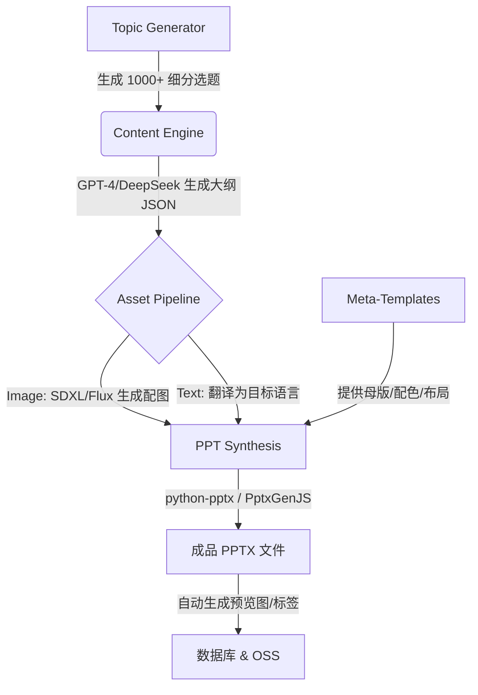

# PPTHub 全球化变现与 AIGC 增长战略研究报告

**报告日期**: 2025-12-06
**分析对象**: PPTHub 平台 (Next.js + AI + PPT 资源站)
**核心目标**: 构建可持续的全球化收益模型与自动化内容生产体系
**研究背景**: 基于公众号私域流量启动，探索从国内市场向全球高价值市场（中东、欧美、拉美）拓展的可行性，并利用 AIGC 技术打破内容生产瓶颈。

---

## 1. 执行摘要 (Executive Summary)

本报告针对 PPTHub 平台当前的流量基础（公众号 8000 粉丝，日均 1000 UV）及技术架构，进行了深度的商业变现推演与增长战略分析。

**核心结论**:
1.  **国内变现策略**: 摒弃低价值的广告联盟模式，采用 **"AdSense 托底 + 激励视频引流 + 积分/会员/CPS 主力变现"** 的混合模型。
2.  **全球化机遇**: 中东 (MENA) 与拉美 (LATAM) 市场是目前竞争最小、ROI 最高的蓝海；欧美 (Tier 1) 市场单价最高但竞争激烈，适合作为长期目标。
3.  **技术壁垒构建**: 利用现有的 AI 能力构建 **"AIGC 自动化内容工厂"**，批量生产多语言、无版权风险的 PPT 模板，以海量长尾内容低成本抢占全球 SEO 流量。

---

## 2. 收益模型深度推演 (Revenue Projection)

### 2.1 模型假设
*   **基准流量**: 1,000 日独立访客 (UV) / 3,500 日浏览量 (PV)。
*   **流量属性**: 办公/教育垂直人群，具有高下载意愿。

### 2.2 分区域收益对比 (日均)

| 收益来源 | 国内市场 (CNY) | 中东市场 (MENA) (CNY) | 欧美市场 (Tier 1) (CNY) | 备注 |
| :--- | :--- | :--- | :--- | :--- |
| **展示广告 (Display)** | ¥30 - ¥40 | ¥300 - ¥450 | ¥900+ | 国内 eCPM 极低；欧美最高。 |
| **激励视频 (Rewarded)** | ¥2 - ¥5 | ¥50 - ¥80 | ¥90+ | 海外用户对“看广告换资源”接受度高。 |
| **联盟/分销 (Affiliate)** | ¥50 - ¥100 (网盘) | ¥100+ (软件/服务) | ¥150+ (SaaS) | 国内靠网盘拉新；海外靠 SaaS 分销。 |
| **总计 (日收入)** | **¥80 - ¥150** | **¥450 - ¥650** | **¥1,100+** | **海外收益是国内的 5-10 倍**。 |

### 2.3 关键洞察
*   **国内市场**: 仅靠广告无法覆盖开发成本。必须依赖 **会员订阅 (Recurring Subscription)** 或 **CPS 分销** (如夸克网盘拉新)。
*   **中东市场**: "流量洼地"。阿拉伯语优质内容极缺，广告单价却接近欧美（石油经济溢价）。是**性价比最高**的出海首站。
*   **欧美市场**: "皇冠上的明珠"。单价极高，但对内容质量和 SEO 要求极高。

---

## 3. 全球化市场拓展战略 (Global Expansion Strategy)

### 3.1 战略路线图: "国内练兵 -> 中东淘金 -> 全球复制"

#### 阶段一：国内打磨 (当前 - 3个月)
*   **目标**: 验证产品 MVP，跑通积分消耗与激励逻辑。
*   **战术**:
    *   利用公众号私域流量进行压力测试。
    *   优化 `NativeAdCard` 与内容流的融合体验。
    *   接入国内合规的变现手段（个人支付接口 + 网盘拉新）。
*   **预期**: 日收益 ¥100+，产品稳定性达标。

#### 阶段二：中东突围 (3个月 - 6个月)
*   **目标**: 利用技术优势快速占领阿拉伯语 PPT 市场。
*   **战术**:
    *   **多语言架构**: 启用 `next-intl` 的 `ar` (阿拉伯语) 支持，适配 RTL (右到左) 布局。
    *   **内容本地化**: 利用 AI 将模板文字批量翻译为阿拉伯语。
    *   **宗教适应**: 剔除人物暴露图片，增加几何/伊斯兰艺术元素。
*   **预期**: 快速获取低成本流量，广告收益翻倍。

#### 阶段三：全球矩阵 (6个月+)
*   **目标**: 建立多语言站点矩阵，覆盖拉美 (西语)、欧洲 (德语/法语)。
*   **战术**:
    *   **西语站 (es)**: 覆盖拉美海量教育用户，走薄利多销路线。
    *   **德语站 (de)**: 覆盖 DACH 地区，提供极简工业风模板，收割高单价广告。

---

## 4. AIGC 自动化内容生产体系 (AI Content Factory)

为解决全球化过程中的"内容饥渴"与"版权风险"，构建自动化生产管线。

### 4.1 技术架构

### 4.2 核心优势
1.  **零版权风险 (Zero Copyright)**: 所有文本、图片、排版均为 AI 原创或自有母版组合，彻底规避出海版权雷区。
2.  **无限长尾 SEO**: 批量生成极细分领域的模板（如"迪拜牙科诊所开业汇报"），精准捕获长尾搜索流量。
3.  **边际成本递减**: 开发一次脚本，生产 1 万个模板的成本仅为 API 调用费，远低于人工。

---

## 5. 风险评估与应对

| 风险点 | 描述 | 应对策略 |
| :--- | :--- | :--- |
| **ICP 备案 (国内)** | 国内主流联盟必须备案，Next.js 架构部署困难。 | 放弃国内联盟，主攻 AdSense (免备案) 和 CPS 私单。 |
| **内容同质化** | AI 生成内容可能千篇一律。 | 建立庞大的 "元模板库" (50+ 母版)，随机组合配色与布局。 |
| **支付合规 (出海)** | 海外收款税务与合规问题。 | 使用 Stripe Merchant (香港/美国主体) 或 Lemon Squeezy (MoR 模式)。 |
| **流量欺诈** | 激励视频可能引来刷量脚本。 | 实施严格的后端 Token 验证与 IP 频次限制 (已在代码中实现)。 |

---

## 6. 下一步行动建议 (Action Plan)

1.  **立即执行**:
    *   保持国内站 AdSense 现状，增加 "网盘拉新" 等 CPS 推广位。
    *   完善 `DownloadModal` 的激励视频逻辑，准备对接 Google AdMob (Web) 或其他激励视频源。

2.  **技术研发**:
    *   启动 **"AI 内容工厂"** 脚本开发。打通 OpenAI 生成大纲 -> 图片生成 -> PPTX 合成的自动化链路。
    *   配置 `ar` (阿拉伯语) 语言环境，测试 RTL 布局适配性。

3.  **运营准备**:
    *   调研中东/拉美市场的热门 PPT 关键词。
    *   注册相关的海外社媒账号 (Pinterest, Reddit, TikTok)，为出海引流做铺垫。

---

**报告结语**:
PPTHub 具备优秀的技术底座与清晰的变现逻辑。通过 "AIGC 内容生产" 与 "全球化套利" 的双轮驱动，项目有望突破国内市场的内卷，在全球范围内实现高 ROI 的商业价值。
