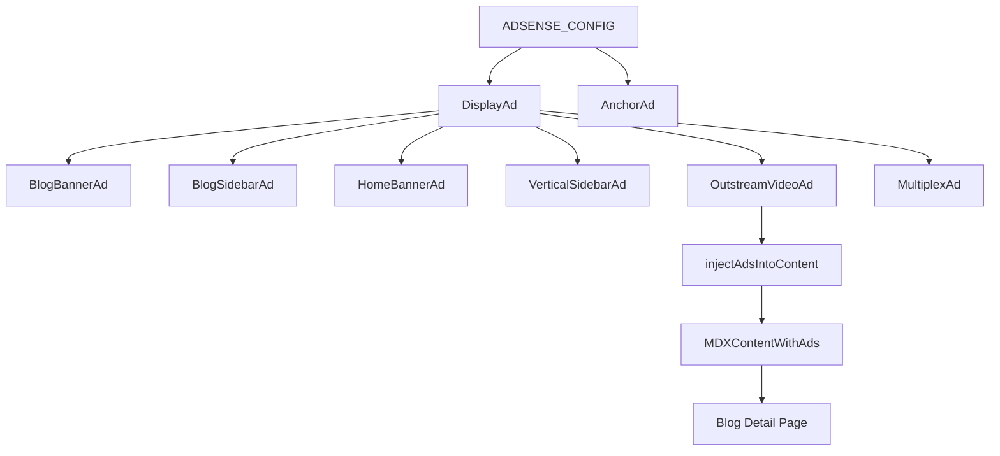

# 广告系统架构深度分析

**分析日期**: 2025-12-03  
**分析范围**: 组件关系、数据流、架构决策

---

## 一、组件层次结构

### 1.1 DisplayAd 组件族

```
DisplayAd (基础组件)
├── 输入: slot, format, className, lazy, fluidLayout
├── 状态: isVisible, adPushed, containerRef
├── 逻辑:
│   ├── IntersectionObserver 懒加载
│   ├── CLS 预防 (预留空间)
│   ├── 测试模式占位符
│   └── AdSense 广告推送
└── 输出: <ins> 标签或占位符
```

**预设组件** (7 个):
| 组件 | Format | Slot | 特点 |
|------|--------|------|------|
| BlogBannerAd | horizontal | blogBanner | 博客横幅 |
| BlogSidebarAd | rectangle | blogSidebar | 侧边栏矩形 |
| HomeBannerAd | horizontal | homeBanner | 首页横幅 |
| VerticalSidebarAd | vertical | vertical | 摩天楼 300×600 |
| OutstreamVideoAd | outstream | outstream | 视频广告 |
| MultiplexAd | multiplex | multiplex | 推荐样式 |

### 1.2 AnchorAd 独立组件

```
AnchorAd (独立组件)
├── 输入: 无 props
├── 状态: dismissed, adPushed
├── 逻辑:
│   ├── sessionStorage 持久化
│   ├── 关闭按钮交互
│   ├── 固定定位 (fixed bottom)
│   └── AdSense 广告推送
└── 输出: 固定底部广告或 null
```

---

## 二、架构决策分析

### 2.1 为什么 AnchorAd 不使用 DisplayAd？

#### 差异对比

| 特性 | DisplayAd | AnchorAd | 原因 |
|------|-----------|----------|------|
| **定位** | 静态/相对 | 固定底部 | 需要 `fixed` 定位 |
| **关闭功能** | 无 | 有 | 需要状态持久化 |
| **懒加载** | 有 | 无 | 始终可见，无需懒加载 |
| **CLS 预防** | 预留空间 | 不占文档流 | 固定定位不影响布局 |
| **Props** | 5 个 | 0 个 | 配置完全内置 |
| **状态管理** | 简单 | 复杂 | 需要 sessionStorage |

#### 核心原因

1. **交互模式不同**
   - DisplayAd: 被动展示
   - AnchorAd: 主动交互 (关闭按钮)

2. **生命周期不同**
   - DisplayAd: 随页面加载/卸载
   - AnchorAd: 跨页面持久化 (sessionStorage)

3. **布局模式不同**
   - DisplayAd: 文档流内，需要预留空间
   - AnchorAd: 脱离文档流，固定视口底部

4. **复用价值低**
   - 如果使用 DisplayAd，需要大量 props 和条件逻辑
   - 独立实现更清晰、可维护

#### 架构决策

**决策**: AnchorAd 作为独立组件实现

**理由**:
1. **单一职责原则**: DisplayAd 负责通用广告，AnchorAd 负责特殊交互
2. **代码清晰度**: 避免 DisplayAd 充斥条件判断
3. **可维护性**: 两个组件独立演进，互不影响
4. **性能优化**: AnchorAd 无需懒加载逻辑

**权衡**:
- ✅ 优点: 代码清晰、职责明确、易于维护
- ⚠️ 缺点: 部分逻辑重复 (AdSense 推送、测试模式)

---

## 三、数据流分析

### 3.1 配置层

```typescript
// src/lib/config/adsense.ts
export const ADSENSE_CONFIG = {
  publisherId: process.env.NEXT_PUBLIC_ADSENSE_PUBLISHER_ID || '',
  enabled: process.env.NEXT_PUBLIC_ADSENSE_ENABLED === 'true',
  testMode: process.env.NODE_ENV === 'development',
  slots: {
    blogBanner: process.env.NEXT_PUBLIC_ADSENSE_BLOG_BANNER || '',
    blogSidebar: process.env.NEXT_PUBLIC_ADSENSE_BLOG_SIDEBAR || '',
    homeBanner: process.env.NEXT_PUBLIC_ADSENSE_HOME_BANNER || '',
    vertical: process.env.NEXT_PUBLIC_ADSENSE_VERTICAL || '',
    outstream: process.env.NEXT_PUBLIC_ADSENSE_OUTSTREAM || '',
    multiplex: process.env.NEXT_PUBLIC_ADSENSE_MULTIPLEX || '',
    anchor: process.env.NEXT_PUBLIC_ADSENSE_ANCHOR || '',
  },
};
```

**数据源**: 环境变量 → 配置对象 → 组件

### 3.2 状态管理

#### DisplayAd 状态

```typescript
const [isVisible, setIsVisible] = useState(!lazy);  // 可见性
const [adPushed, setAdPushed] = useState(false);    // 推送状态
const containerRef = useRef<HTMLDivElement>(null);  // DOM 引用
```

**状态流**:
```
初始化 → IntersectionObserver 监听 → 进入视口 → 
setIsVisible(true) → useEffect 触发 → 推送广告 → 
setAdPushed(true)
```

#### AnchorAd 状态

```typescript
const [dismissed, setDismissed] = useState(true);   // 关闭状态
const [adPushed, setAdPushed] = useState(false);    // 推送状态
```

**状态流**:
```
初始化 (dismissed=true) → useEffect 读取 sessionStorage → 
setDismissed(false) → 渲染广告 → 用户点击关闭 → 
sessionStorage.setItem → setDismissed(true) → 返回 null
```

### 3.3 广告注入流

```typescript
// src/lib/mdx/inject-ads.tsx
injectAdsIntoContent(children, options)
    ↓
1. Children.toArray(children)
    ↓
2. 统计段落数 (child.type === 'p')
    ↓
3. 判断是否满足注入条件 (≥ minParagraphs)
    ↓
4. 计算注入位置 (firstAdAfter, adInterval, maxAds)
    ↓
5. 插入 <OutstreamVideoAd /> 组件
    ↓
6. 返回新的 children 数组
```

**使用链**:
```
MDX 内容 → MDXContentWithAds 包装 → 
injectAdsIntoContent 处理 → 插入广告组件 → 渲染
```

---

## 四、依赖关系图

### 4.1 组件依赖



### 4.2 数据依赖

```
环境变量 (.env.local)
    ↓
ADSENSE_CONFIG (配置对象)
    ↓
    ├── DisplayAd (读取 enabled, testMode, publisherId, slots)
    └── AnchorAd (读取 enabled, testMode, publisherId, slots.anchor)
```

### 4.3 外部依赖

```
window.adsbygoogle (AdSense SDK)
    ↑
    ├── DisplayAd (useEffect 推送)
    └── AnchorAd (useEffect 推送)

sessionStorage (浏览器 API)
    ↑
    └── AnchorAd (读写 dismissed 状态)

IntersectionObserver (浏览器 API)
    ↑
    └── DisplayAd (懒加载监听)
```

---

## 五、关键逻辑分析

### 5.1 广告注入算法

**输入**: React.ReactNode, InjectAdsOptions

**算法**:
```typescript
function injectAdsIntoContent(children, options) {
  // 1. 扁平化 children
  const childArray = Children.toArray(children);
  
  // 2. 统计段落索引
  const paragraphIndices = childArray
    .map((child, index) => isValidElement(child) && child.type === 'p' ? index : -1)
    .filter(index => index !== -1);
  
  // 3. 检查最小段落数
  if (paragraphIndices.length < minParagraphs) return children;
  
  // 4. 计算注入位置
  const insertPositions = [];
  let adsInserted = 0;
  let lastAdParagraph = -adInterval;
  
  for (let i = 0; i < paragraphIndices.length && adsInserted < maxAds; i++) {
    const paragraphNum = i + 1;
    if (paragraphNum >= firstAdAfter && paragraphNum - lastAdParagraph >= adInterval) {
      insertPositions.push(paragraphIndices[i]);
      lastAdParagraph = paragraphNum;
      adsInserted++;
    }
  }
  
  // 5. 反向插入 (保持索引稳定)
  insertPositions.reverse().forEach((position, idx) => {
    result.splice(position + 1, 0, <OutstreamVideoAd key={...} />);
  });
  
  return result;
}
```

**时间复杂度**: O(n) where n = children.length  
**空间复杂度**: O(n) (复制 childArray)

### 5.2 懒加载逻辑

```typescript
useEffect(() => {
  if (!lazy || !containerRef.current) {
    setIsVisible(true);
    return;
  }

  const observer = new IntersectionObserver(
    (entries) => {
      if (entries[0]?.isIntersecting) {
        setIsVisible(true);
        observer.disconnect();
      }
    },
    { rootMargin: '200px' }  // 提前 200px 加载
  );

  observer.observe(containerRef.current);
  return () => observer.disconnect();
}, [lazy]);
```

**优化点**:
- `rootMargin: '200px'`: 提前加载，减少白屏
- `observer.disconnect()`: 触发后立即断开，节省资源
- 清理函数: 组件卸载时断开观察

### 5.3 CLS 预防策略

```typescript
const dimensions = formatDimensions[format];

// 预留空间
<div style={{
  minHeight: dimensions.minHeight,
  minWidth: dimensions.minWidth,
  aspectRatio: dimensions.aspectRatio,
}}>
  {!adPushed && <Skeleton />}  // 加载前显示骨架屏
  {isVisible && <ins ... />}    // 广告内容
</div>
```

**原理**: 在广告加载前预留固定空间，避免布局偏移

---

## 六、性能分析

### 6.1 渲染性能

| 场景 | DisplayAd | AnchorAd |
|------|-----------|----------|
| 初始渲染 | 创建 ref + 2 state | 创建 2 state |
| 懒加载 | IntersectionObserver | 无 (始终可见) |
| 广告推送 | useEffect 触发 | useEffect 触发 |
| 重渲染 | 最多 2 次 (isVisible, adPushed) | 最多 2 次 (dismissed, adPushed) |

### 6.2 内存占用

```
DisplayAd (单个实例):
- containerRef: ~8 bytes
- isVisible state: ~4 bytes
- adPushed state: ~4 bytes
- IntersectionObserver: ~1KB
Total: ~1KB

AnchorAd (单个实例):
- dismissed state: ~4 bytes
- adPushed state: ~4 bytes
- sessionStorage entry: ~50 bytes
Total: ~60 bytes
```

### 6.3 网络请求

```
每个广告组件:
1. AdSense SDK 加载 (首次): ~50KB
2. 广告内容请求: ~10-100KB (取决于广告类型)
3. 广告资源 (图片/视频): ~100KB-2MB
```

---

## 七、测试策略

### 7.1 单元测试范围

**DisplayAd**:
- ✅ 空 slot 返回 null
- ✅ 禁用状态返回 null
- ✅ 测试模式渲染占位符
- ✅ 格式维度正确
- ⚠️ 懒加载逻辑 (需要 mock IntersectionObserver)

**AnchorAd**:
- ✅ 关闭后返回 null
- ✅ sessionStorage 持久化
- ✅ 测试模式渲染占位符

**injectAdsIntoContent**:
- ⚠️ **关键**: 广告注入规则 (Property 6)
- ⚠️ 段落数判断
- ⚠️ 注入位置计算
- ⚠️ 最大广告数限制

### 7.2 集成测试范围

- 博客详情页广告显示
- 博客列表页广告显示
- 广告自动注入功能
- 锚定广告关闭功能

---

## 八、潜在问题与优化

### 8.1 已知问题

1. **代码重复**: DisplayAd 和 AnchorAd 的 AdSense 推送逻辑重复
2. **测试覆盖**: 缺少自动化测试
3. **错误处理**: AdSense 加载失败时无降级方案

### 8.2 优化建议

1. **提取公共逻辑**:
```typescript
// src/lib/ads/use-adsense-push.ts
export function useAdsensePush(slot: string, enabled: boolean) {
  const [adPushed, setAdPushed] = useState(false);
  
  useEffect(() => {
    if (!enabled || !slot || adPushed) return;
    try {
      (window.adsbygoogle = window.adsbygoogle || []).push({});
      setAdPushed(true);
    } catch (err) {
      console.error('AdSense push error:', err);
    }
  }, [enabled, slot, adPushed]);
  
  return adPushed;
}
```

2. **错误边界**:
```typescript
<ErrorBoundary fallback={null}>
  <DisplayAd ... />
</ErrorBoundary>
```

3. **性能监控**:
```typescript
// 监控广告加载时间
performance.mark('ad-start');
// ... 广告加载
performance.mark('ad-end');
performance.measure('ad-load', 'ad-start', 'ad-end');
```

---

## 九、总结

### 9.1 架构优势

1. **清晰的职责分离**: DisplayAd 通用，AnchorAd 特殊
2. **良好的扩展性**: 新增广告类型只需添加预设组件
3. **性能优化**: 懒加载、CLS 预防、早期返回

### 9.2 架构决策合理性

**AnchorAd 独立实现**: ✅ **合理**

**理由**:
- 交互模式差异大 (关闭功能)
- 布局模式差异大 (固定定位)
- 状态管理差异大 (sessionStorage)
- 复用 DisplayAd 会增加复杂度

### 9.3 改进方向

1. **补充测试**: 尤其是 Property 6 (广告注入规则)
2. **文档完善**: 明确架构决策原因
3. **代码优化**: 提取公共 hooks (可选)

---

**分析完成时间**: 2025-12-03 23:01
