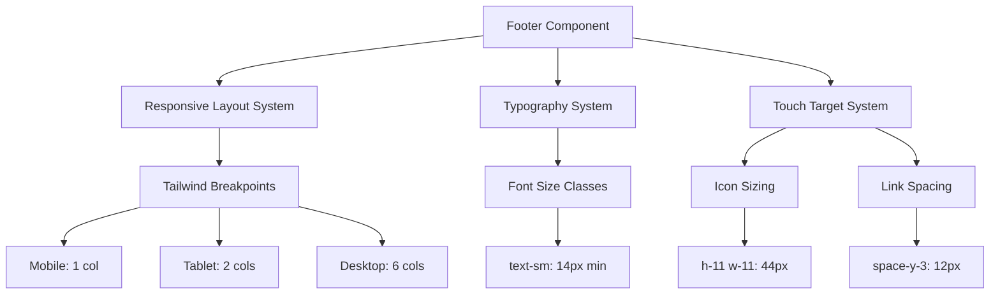

# Feature Design: Mobile Compatibility

## Overview

本设计文档描述了 PPTHub 移动端兼容性优化的技术实现方案。核心目标是修复 Footer 组件的移动端问题（影响全站 48 页），并验证核心页面的移动端表现。设计采用 Tailwind CSS 响应式工具类，确保符合 WCAG AA 标准和 Google AdSense 要求。

## Architecture



## Components and Interfaces

### Footer Component

**Location**: `src/components/layout/footer.tsx`

**Responsibilities**:
- 渲染全站页脚内容（品牌、分类、资源、支持、关于、合作伙伴、版权）
- 响应式布局适配（1/2/6 列）
- 社交图标渲染和交互
- 国际化内容显示

**Key Props**:
```typescript
interface FooterProps extends React.HTMLAttributes<HTMLElement> {
  className?: string;
}
```

**Dependencies**:
- `@/components/layout/container`: 容器组件
- `@/components/layout/logo`: Logo 组件
- `@/config/social-config`: 社交链接配置
- `@/i18n/navigation`: 国际化路由
- `next-intl`: 翻译函数

## Data Models

### Responsive Breakpoints

```typescript
const BREAKPOINTS = {
  mobile: '< 768px',    // 1 column
  tablet: '768-1024px', // 2 columns
  desktop: '>= 1024px'  // 6 columns
} as const;
```

### Typography Scale

```typescript
const MOBILE_TYPOGRAPHY = {
  body: 'text-sm',      // 14px - 主体文字
  small: 'text-sm',     // 14px - 小字（原 text-xs 12px）
  heading: 'text-sm',   // 14px - 标题
} as const;
```

### Touch Target Sizes

```typescript
const TOUCH_TARGETS = {
  socialIcon: 'h-11 w-11',  // 44px (原 h-8 w-8 32px)
  iconGap: 'gap-3',         // 12px (原 gap-2 8px)
  linkSpacing: 'space-y-3', // 12px (原 space-y-2 8px)
} as const;
```

## Correctness Properties

### Prework: Testability Analysis

**1.1** Footer 最小字体 14px (移动端)
  Thoughts: 可以通过计算样式验证所有文本元素的 font-size >= 14px
  Testable: yes - property

**1.2** Footer 桌面端字体优化
  Thoughts: 可以验证在 >= 768px 视口下字体大小符合预期
  Testable: yes - property

**1.3** 使用 Tailwind 响应式类
  Thoughts: 可以检查 className 包含正确的 Tailwind 类
  Testable: yes - example

**1.4** 320px 视口无横向滚动
  Thoughts: 可以测量 scrollWidth === clientWidth
  Testable: yes - property

**2.1** 社交图标最小 44x44px
  Thoughts: 可以通过 getBoundingClientRect 验证尺寸
  Testable: yes - property

**2.2** 图标间距最小 8px
  Thoughts: 可以计算相邻图标的间距
  Testable: yes - property

**2.3** 移动端点击无需精确定位
  Thoughts: 主观体验，由 2.1 保证
  Testable: no

**2.4** Hover/focus 状态可见
  Thoughts: 可以验证 CSS 类存在
  Testable: yes - example

**3.1** 链接垂直间距最小 12px
  Thoughts: 可以测量相邻链接的间距
  Testable: yes - property

**3.2** 链接最小高度 44px
  Thoughts: 可以验证 TouchTarget 高度
  Testable: yes - property

**3.3** 对比度 >= 4.5:1
  Thoughts: 可以计算颜色对比度
  Testable: yes - property

**3.4** 键盘/屏幕阅读器导航
  Thoughts: 可以验证语义 HTML 和 ARIA 属性
  Testable: yes - example

**4.1-4.3** 响应式列布局
  Thoughts: 可以验证不同视口下的列数
  Testable: yes - property

**4.4** 无横向滚动
  Thoughts: 可以在所有断点测量 scrollWidth
  Testable: yes - property

**4.5** Footer 不重叠内容
  Thoughts: 可以验证 position 和 z-index
  Testable: yes - example

**5.1-5.4** 核心页面移动端验证
  Thoughts: 需要对每个页面进行集成测试
  Testable: yes - example

**6.1-6.4** 性能指标
  Thoughts: 需要使用 Lighthouse/WebPageTest 测量
  Testable: yes - example

### Property Reflection

- Property 1 (字体大小) 和 Property 4 (无横向滚动) 相关但独立 - 保留
- Property 2 (图标尺寸) 和 Property 3 (图标间距) 独立验证不同方面 - 保留
- Property 5 (链接间距) 和 Property 6 (链接高度) 独立 - 保留
- Property 7 (对比度) 独立验证可访问性 - 保留
- Property 8 (响应式布局) 覆盖多个断点 - 保留

### Correctness Properties

**Property 1: Minimum font size on mobile**

*For any* text element within the Footer component when ViewportWidth is less than 768px, the computed font-size should be greater than or equal to 14 pixels.

**Validates: Requirements 1.1**

---

**Property 2: Social icon touch target size**

*For any* social media icon element within the Footer component, the bounding box dimensions should be at least 44x44 pixels.

**Validates: Requirements 2.1**

---

**Property 3: Social icon spacing**

*For any* pair of adjacent social media icons within the Footer component, the horizontal distance between their bounding boxes should be at least 8 pixels.

**Validates: Requirements 2.2**

---

**Property 4: No horizontal overflow at minimum viewport**

*For any* viewport width of 320 pixels or greater, the Footer component's scrollWidth should equal its clientWidth (no horizontal scrolling required).

**Validates: Requirements 1.4, 4.4**

---

**Property 5: Link vertical spacing on mobile**

*For any* pair of vertically adjacent navigation links within the Footer component when ViewportWidth is less than 768px, the vertical distance between their bounding boxes should be at least 12 pixels.

**Validates: Requirements 3.1**

---

**Property 6: Link touch target height**

*For any* clickable link element within the Footer component on mobile devices, the bounding box height should be at least 44 pixels.

**Validates: Requirements 3.2**

---

**Property 7: Text contrast ratio**

*For any* text element within the Footer component, the color contrast ratio between text and background should be at least 4.5:1.

**Validates: Requirements 3.3**

---

**Property 8: Responsive column layout**

*For any* viewport width, the Footer component should display:
- 1 column when width < 768px
- 2 columns when 768px ≤ width < 1024px
- 6 columns when width ≥ 1024px

**Validates: Requirements 4.1, 4.2, 4.3**

## Error Handling

### Invalid Viewport Sizes
- **Scenario**: ViewportWidth < 320px (极小设备)
- **Handling**: 保持 320px 的布局，允许横向滚动
- **User Feedback**: 无需特殊提示

### Missing Social Links
- **Scenario**: `socialLinks` 为空或 undefined
- **Handling**: 不渲染社交图标区域
- **User Feedback**: 无视觉错误

### Translation Missing
- **Scenario**: 翻译键不存在
- **Handling**: next-intl 显示键名作为后备
- **User Feedback**: 开发环境显示警告

## Testing Strategy

### Unit Testing
使用 **Vitest + React Testing Library** 进行组件单元测试：

```typescript
// 示例测试
describe('Footer Component', () => {
  it('renders all navigation sections', () => {
    render(<Footer />);
    expect(screen.getByText(/categories/i)).toBeInTheDocument();
    expect(screen.getByText(/resources/i)).toBeInTheDocument();
  });
  
  it('applies correct Tailwind classes for responsive layout', () => {
    const { container } = render(<Footer />);
    const grid = container.querySelector('.grid');
    expect(grid).toHaveClass('lg:grid-cols-6', 'md:grid-cols-2', 'grid-cols-1');
  });
});
```

### Property-Based Testing
使用 **Playwright** 进行端到端属性测试（每个属性至少 100 次迭代）：

```typescript
// 框架: Playwright
// 迭代次数: 针对多个视口尺寸和设备

// **Feature: mobile-compatibility, Property 1: Minimum font size on mobile**
test('all footer text has minimum 14px font size on mobile', async ({ page }) => {
  await page.setViewportSize({ width: 375, height: 667 });
  await page.goto('/');
  
  const textElements = await page.locator('footer *').all();
  for (const el of textElements) {
    const fontSize = await el.evaluate(e => 
      parseFloat(window.getComputedStyle(e).fontSize)
    );
    if (fontSize > 0) { // 忽略不可见元素
      expect(fontSize).toBeGreaterThanOrEqual(14);
    }
  }
});

// **Feature: mobile-compatibility, Property 2: Social icon touch target size**
test('social icons meet minimum touch target size', async ({ page }) => {
  await page.goto('/');
  
  const icons = await page.locator('footer a[aria-label]').all();
  for (const icon of icons) {
    const box = await icon.boundingBox();
    expect(box.width).toBeGreaterThanOrEqual(44);
    expect(box.height).toBeGreaterThanOrEqual(44);
  }
});
```

### Integration Testing
使用 **Playwright** 验证核心页面：

- 测试 P0 优先级页面（22 页）
- 验证字体大小、触摸目标、响应式布局
- 使用真实设备模拟（iPhone SE, Pixel 5, iPad）

### Performance Testing
使用 **Lighthouse CI** 验证性能指标：

- LCP < 2.5s
- FID < 100ms
- CLS < 0.1
- 在 3G 网络条件下测试

## Implementation Notes

### Tailwind Class Changes

| 元素 | 原类名 | 新类名 | 原因 |
|------|--------|--------|------|
| 描述文字 | `text-xs` | `text-sm` | 12px → 14px |
| 统计数据 | `text-xs` | `text-sm` | 12px → 14px |
| 社交图标 | `h-8 w-8` | `h-11 w-11` | 32px → 44px |
| 图标间距 | `gap-2` | `gap-3` | 8px → 12px |
| 链接间距 | `space-y-2` | `space-y-3` | 8px → 12px |
| 合作伙伴文字 | `text-xs` | `text-sm` | 12px → 14px |
| 版权文字 | `text-xs` | `text-sm` | 12px → 14px |

### Accessibility Enhancements

- 保持现有 `aria-label` 属性
- 保持 `sr-only` 屏幕阅读器文本
- 确保 `rel="noopener noreferrer"` 用于外部链接
- 验证键盘导航顺序

### Performance Considerations

- 无需额外 JavaScript
- 纯 CSS 响应式实现
- 不影响现有性能指标
- 减少 CLS（布局更稳定）
