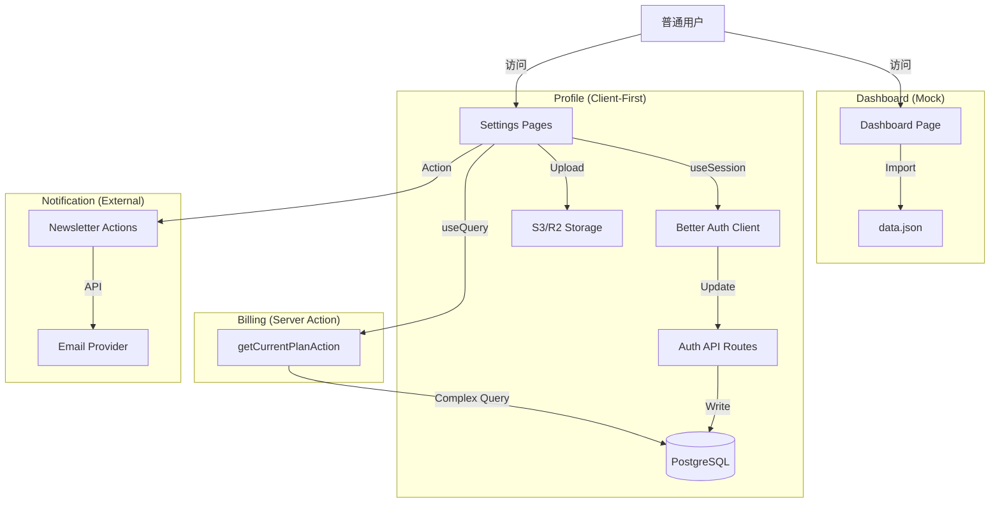

# 普通用户前台页面深度分析报告

**生成时间**: 2025-12-12
**分析范围**: 用户仪表盘 (Dashboard), 个人设置 (Settings)

---

## 一、 核心配置与常量定义

### 1.1 全局配置
- **位置**: `src/config/website.tsx`
- **关键控制**:
  - `features.enableUpdateAvatar`: 控制是否显示头像上传卡片。
  - `storage.enable`: 控制文件上传功能是否开启。
  - `newsletter.enable`: 控制通知设置页面的显隐。
  - `auth.enableCredentialLogin`: 控制安全设置页面的“修改密码”卡片显隐。

---

## 二、 数据库核心 Schema 分析

### 2.1 用户与认证 (`user`, `account`)
- **表名**: `user`
- **关键字段**: `name`, `image`, `email`。
- **关联**: `account` 表存储 OAuth 关联信息。

### 2.2 支付与订阅 (`payment`)
- **设计**: 单表聚合订阅与一次性支付。
- **关键字段**: `status` (active/trialing), `type` (subscription/one_time), `scene` (lifetime), `price_id`, `period_end`。
- **查询逻辑**: 优先查询 `lifetime` 会员资格，其次查询 `active` 订阅，最后降级为 `free` 方案。

### 2.3 通知订阅 (`newsletter` - 外部服务)
- **依赖**: Resend 或类似邮件服务 (非直接数据库表，通过 API 管理状态)。
- **逻辑**: 前端通过 `useSubscribeNewsletter` Hook 调用 Server Action。

---

## 三、 各模块数据链路深度追踪

### 3.1 🏠 用户仪表盘 (Dashboard)
- **页面**: `src/app/[locale]/(protected)/dashboard/page.tsx`
- **现状**: **⚠️ 完全 Mock 数据**
- **数据链路**:
  - 直接引入 `data.json` 文件。
  - 组件 `ChartAreaInteractive`, `DataTable`, `SectionCards` 均使用静态数据渲染。
  - **严重问题**: 没有任何真实业务数据接入（如最近下载 PPT、当前积分余额等）。

### 3.2 👤 个人资料 (Settings - Profile)
- **页面**: `src/app/[locale]/(protected)/settings/profile/page.tsx`
- **现状**: **✅ 真实数据 (Client-Side Auth)**
- **数据链路**:
  1. **读取**: 使用 `authClient.useSession()` 直接从客户端 Session 读取 `user.name` 和 `user.image`。
  2. **更新姓名**: 调用 `authClient.updateUser({ name })`。
  3. **更新头像**:
     - 调用 `uploadFileFromBrowser` 上传文件到存储 (S3/R2)。
     - 回调中获取 URL，再次调用 `authClient.updateUser({ image: url })`。
- **优点**: 充分利用 `better-auth` 的客户端能力，减少后端胶水代码。

### 3.3 💳 账单与订阅 (Settings - Billing)
- **页面**: `src/app/[locale]/(protected)/settings/billing/page.tsx`
- **现状**: **✅ 真实数据**
- **Action**: `getCurrentPlanAction` (`src/actions/get-current-plan.ts`)
- **逻辑**:
  - **复杂查询优化**: 一个 SQL 查询同时获取所有已支付订单 (`paid = true`)。
  - **优先级逻辑**: 代码中明确了 `Lifetime Plan` > `Active Subscription` > `Free Plan` 的判定优先级。
  - **状态展示**: 准确展示试用期 (`trialing`)、到期日等信息。

### 3.4 🔔 通知设置 (Settings - Notification)
- **页面**: `src/app/[locale]/(protected)/settings/notifications/page.tsx`
- **现状**: **✅ 真实逻辑**
- **Hooks**: `useNewsletterStatus`, `useSubscribeNewsletter`。
- **逻辑**: 通过 Server Actions 调用邮件服务商 API 管理订阅状态，非直接操作数据库。

### 3.5 🔐 安全设置 (Settings - Security)
- **页面**: `src/app/[locale]/(protected)/settings/security/page.tsx`
- **现状**: **✅ 真实逻辑**
- **模块**:
  - **修改密码**: 仅当 `enableCredentialLogin` 开启时显示。
  - **删除账号**: 调用 `authClient.deleteUser()`，包含二次确认弹窗。

---

## 四、 架构数据流图



---

## 五、 优缺点与风险分析

### ✅ 优点
1.  **Better Auth 集成度高**: 个人资料修改直接利用了 Auth 库的内置能力，无需手写 CRUD。
2.  **计费逻辑严谨**: `Billing` 模块对“买断制”和“订阅制”的共存处理逻辑清晰，防止了权益冲突。
3.  **交互体验好**: 头像上传支持本地预览 (`URL.createObjectURL`)，删除账号有防误触确认。

### ⚠️ 潜在风险 & 缺点
1.  **Dashboard 是空的**: 用户登录后第一眼看到的 Dashboard 完全是假数据，没有任何实用价值（如“最近浏览”、“收藏的 PPT”等）。这是上线前的最大体验短板。
2.  **头像上传依赖客户端**: `uploadFileFromBrowser` 在客户端直接上传，需确保后端 Presigned URL 生成逻辑包含严格的类型和大小校验，防止滥用。

---

## 六、 改进建议 (Action Plan)

### 🚀 短期 (上线前必做)
1.  **实装 Dashboard**:
    - 移除 `data.json`。
    - 新增 `getUserDashboardStats` Action，查询：
      - 用户当前积分 (`userCredit`).
      - 最近下载记录 (`user_download_history` join `ppt`).
      - 收藏/点赞的 PPT (如有此功能).
    - 将上述数据渲染到 Dashboard 卡片中。

### 📅 中期 (优化)
1.  **头像裁剪**: 目前头像上传是直接上传原图，建议增加前端裁剪功能，确保头像显示效果最佳。
2.  **操作日志**: 增加用户关键操作（如修改密码、删除账号）的审计日志 `user_audit_log`。

---

## 七、Dashboard 重构详细设计方案 (Detailed Design)

基于现状分析，我们将彻底重构 Dashboard，从“管理员监控视角”转型为 **“用户资产与服务中心”**。

### 7.1 核心设计理念
用户登录后，应当一眼看到：**我的身份（会员/积分）**、**我的资产（收藏/下载）**、**我的权益（充值/升级）**。

### 7.2 实施阶段规划

#### 第一阶段：基础设施与数据层改造 (Foundation)
*   **数据库**: 新增 `user_favorite` 表，补全收藏能力。
    *   **字段**: `id`, `user_id`, `ppt_id`, `created_at`。
    *   **约束**: 复合唯一索引 `(user_id, ppt_id)`。
*   **配置**:
    *   开启 `credits.enableCredits` (激活积分钱包)。
    *   建议开启 `features.pptRequireLoginForDownload` (建立价值闭环)。

#### 第二阶段：后端逻辑层 (Server Actions)
*   **`getUserDashboardStats`**: 聚合查询接口，一次性返回积分余额、会员状态、下载数、收藏数。
*   **`toggleFavorite`**: 智能收藏/取消收藏 Action。
*   **`getRecentDownloads`**: 联表查询最近下载记录 (包含 PPT 封面和标题)。

#### 第三阶段：UI 组件层重构 (UI Components)

**布局结构**:
```text
+---------------------------------------------------------------+
|  Dashboard Header [👋 Good morning, User]                     |
+---------------------------------------------------------------+
|  [ 💳 Credit: 1,200 ]  [ 💎 Plan: Pro ]  [ 📥 Downloads: 56 ] |
|  [ Buy Credits ]       [ Manage ]        [ Browse ]           |
+---------------------------------------------------------------+
|  +-----------------------------+ +--------------------------+ |
|  | [Recent Downloads] [Favorites]| |  📢 Daily Tasks        | |
|  |                             | |  [🎥 Watch Ad (+5)]      | |
|  |  [PPT] Business Plan        | |  [✅ Sign In (+1)]       | |
|  |  -10 Credits • 2h ago       | +--------------------------+ |
|  +-----------------------------+                              |
+---------------------------------------------------------------+
```

**关键组件**:
1.  **`StatCard`**: 资产概览卡片，强调数字与行动按钮。
2.  **`RecentDownloadsList`**: 列表展示最近下载，提供“再次下载”快捷入口。
3.  **`FavoritesGrid`**: 网格展示收藏内容，支持快速取消收藏。
4.  **`DailyTaskCard`**: (可选) 广告奖励入口，提升用户活跃度。

#### 第四阶段：全局入口优化
*   **恢复入口**: 在 `avatar-config.tsx` 中取消 Dashboard 链接的注释。
*   **积分悬浮**: 在 Navbar 用户头像旁显示当前积分余额。

---

## 八、 相关文件清单
- `src/app/[locale]/(protected)/dashboard/page.tsx` (**需重构**)
- `src/app/[locale]/(protected)/settings/profile/page.tsx`
- `src/app/[locale]/(protected)/settings/billing/page.tsx`
- `src/actions/get-current-plan.ts`
- `src/config/website.tsx`
- `src/db/schema.ts` (**需修改**)