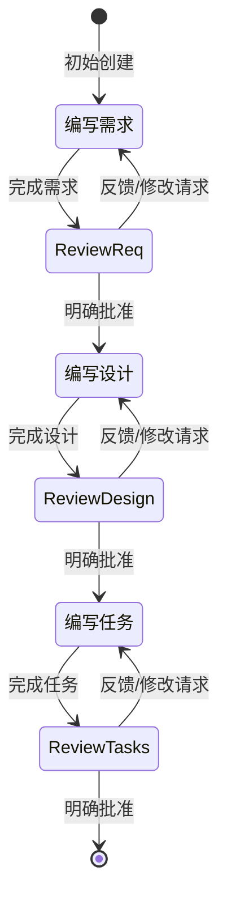

# Kiro Specs 方法论详解

## 概述

Kiro Specs 是一种将软件开发形式化的方法论，核心目标是：
1. 将模糊的功能想法转化为精确的需求规范
2. 基于需求创建可验证的设计文档
3. 生成可执行的实现任务清单
4. 通过属性测试 (Property-Based Testing) 验证软件正确性

## 工作流程



## 三个核心阶段

### 阶段 1: 需求收集与规范 (Requirements)

**目标**: 使用 EARS 模式和 INCOSE 质量规则生成精确的需求文档

**输出文件**: `.kiro/specs/{feature_name}/requirements.md`

**关键原则**:
- 每个需求必须遵循 EARS 六种模式之一
- 所有需求必须符合 INCOSE 语义质量规则
- 包含用户故事和验收标准
- 定义术语表确保一致性

### 阶段 2: 功能设计文档 (Design)

**目标**: 基于需求创建详细的技术设计，包含正确性属性

**输出文件**: `.kiro/specs/{feature_name}/design.md`

**关键原则**:
- 包含架构、组件、数据模型等技术细节
- 定义可测试的正确性属性 (Correctness Properties)
- 每个属性必须包含"对于所有"(for all) 的全称量化声明
- 属性必须引用对应的需求条款

### 阶段 3: 任务清单 (Tasks)

**目标**: 将设计转化为可执行的编码任务

**输出文件**: `.kiro/specs/{feature_name}/tasks.md`

**关键原则**:
- 任务必须是编码代理可执行的具体操作
- 使用编号复选框格式，最多两级层次
- 每个任务引用具体的需求条款
- 属性测试任务紧跟实现任务

## 迭代与批准机制

每个阶段都遵循严格的迭代-批准循环：

1. **生成初稿** - 基于输入生成文档初稿
2. **用户审查** - 明确询问用户是否批准
3. **反馈修改** - 根据用户反馈修改文档
4. **重复直到批准** - 只有收到明确批准才进入下一阶段

**批准信号示例**: "yes", "approved", "looks good", "可以", "批准"

## 文件组织结构

```
.kiro/
└── specs/
    └── {feature-name}/           # 使用 kebab-case 命名
        ├── requirements.md       # 需求文档
        ├── design.md             # 设计文档
        └── tasks.md              # 任务清单
```

## 核心价值

### 1. 形式化正确性
通过属性测试验证软件行为，而非仅依赖示例测试

### 2. 可追溯性
从需求 → 设计 → 任务 → 代码，每一步都有明确的引用关系

### 3. 增量开发
任务按顺序执行，每个任务都建立在前一个任务的基础上

### 4. 用户控制
每个阶段都需要用户明确批准，确保方向正确

## 与传统开发的区别

| 方面 | 传统开发 | Kiro Specs |
|------|----------|------------|
| 需求 | 自然语言，模糊 | EARS 模式，精确 |
| 设计 | 可选，非形式化 | 必需，包含正确性属性 |
| 测试 | 示例驱动 | 属性驱动 + 示例 |
| 验证 | 手动 QA | 自动化属性测试 |
| 追溯 | 困难 | 内置引用机制 |
