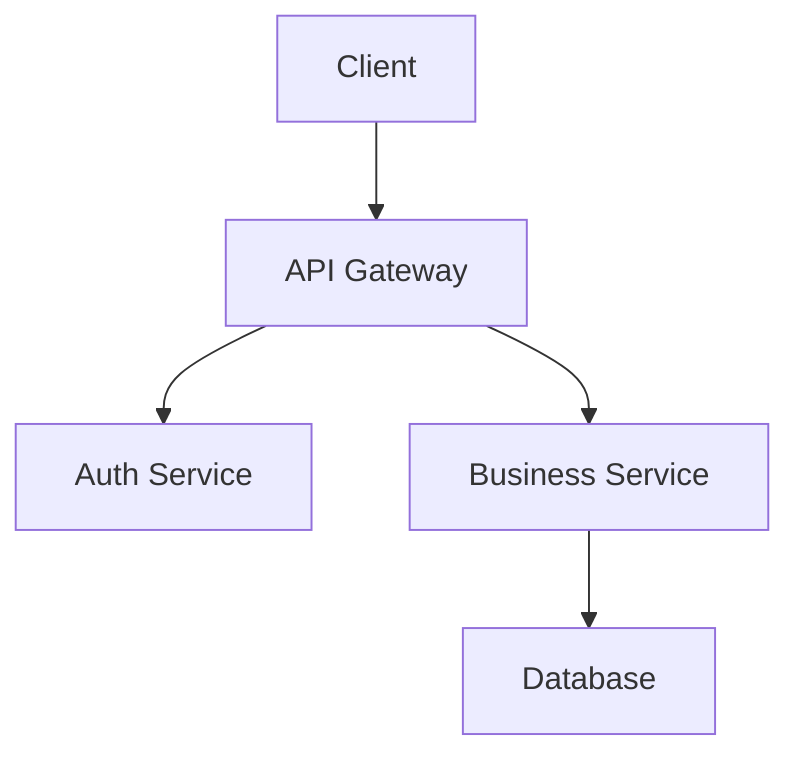

# 设计文档标准

## 概述

设计文档基于已批准的需求文档创建，包含技术架构、组件设计和**正确性属性 (Correctness Properties)**。

## 文档结构

设计文档**必须**包含以下章节：

```markdown
# Feature Design: {Feature Name}

## Overview
## Architecture
## Components and Interfaces
## Data Models
## Correctness Properties
## Error Handling
## Testing Strategy
```

## 各章节要求

### Overview (概述)
- 功能的高层描述
- 与现有系统的关系
- 主要设计决策及其理由

### Architecture (架构)
- 系统架构图 (推荐使用 Mermaid)
- 组件间的交互关系
- 数据流向



### Components and Interfaces (组件与接口)
- 每个组件的职责
- 公开接口定义
- 依赖关系

```typescript
interface UserService {
  createUser(data: CreateUserInput): Promise<User>;
  getUserById(id: string): Promise<User | null>;
  updateUser(id: string, data: UpdateUserInput): Promise<User>;
  deleteUser(id: string): Promise<void>;
}
```

### Data Models (数据模型)
- 核心数据结构定义
- 数据库 schema (如适用)
- 数据验证规则

```typescript
interface User {
  id: string;
  email: string;
  name: string;
  createdAt: Date;
  updatedAt: Date;
}
```

### Correctness Properties (正确性属性)

**这是设计文档的核心章节**

#### 什么是正确性属性

> *A property is a characteristic or behavior that should hold true across all valid executions of a system—essentially, a formal statement about what the system should do. Properties serve as the bridge between human-readable specifications and machine-verifiable correctness guarantees.*

#### 属性格式

每个属性**必须**包含：
1. 全称量化声明 (*For any*...)
2. 属性描述
3. 需求引用 (**Validates: Requirements X.Y**)

```markdown
**Property 1: Task addition increases list length**

*For any* task list and valid (non-empty) task description, adding it to the task list should result in the length of the task list growing by one.

**Validates: Requirements 1.1**
```

#### 属性编写流程

1. **前置分析 (Prework)** - 分析每个验收标准的可测试性
2. **属性反思 (Reflection)** - 消除冗余属性
3. **属性编写** - 将可测试的标准转化为属性

### Error Handling (错误处理)
- 错误类型定义
- 错误处理策略
- 用户反馈机制

### Testing Strategy (测试策略)
- 单元测试方法
- 属性测试方法
- 测试框架选择

## 正确性属性详解

### 可测试性分析 (Prework)

在编写属性前，对每个验收标准进行分析：

```
X.Y 标准名称
  Thoughts: 关于可测试性的逐步思考
  Testable: yes - property | yes - example | no | edge-case
```

**分类说明**:
- **yes - property**: 可以作为属性测试，适用于所有输入
- **yes - example**: 只能作为示例测试，针对特定情况
- **no**: 不可自动测试 (如 UI 美观性)
- **edge-case**: 边界情况，由生成器处理

### 常见属性模式

#### 1. 不变量 (Invariants)
操作后保持不变的属性。

```markdown
**Property: Collection size after map**

*For any* collection and transformation function, mapping the function over the collection should preserve the collection's length.

**Validates: Requirements 2.1**
```

#### 2. 往返属性 (Round-trip)
操作与逆操作组合返回原值。**解析器/序列化器必须包含此属性**。

```markdown
**Property: Serialization round trip**

*For any* valid system object, serializing then deserializing should produce an equivalent object.

**Validates: Requirements 3.1**
```

#### 3. 幂等性 (Idempotence)
多次执行等于执行一次。

```markdown
**Property: Deduplication idempotence**

*For any* list, applying the distinct filter twice should produce the same result as applying it once.

**Validates: Requirements 4.2**
```

#### 4. 变形属性 (Metamorphic)
已知的输入输出关系。

```markdown
**Property: Filter reduces length**

*For any* non-empty list and filter predicate, the filtered list length should be less than or equal to the original length.

**Validates: Requirements 5.1**
```

#### 5. 错误条件 (Error Conditions)
错误输入产生正确错误。

```markdown
**Property: Invalid input rejection**

*For any* string composed entirely of whitespace, attempting to add it as a task should be rejected and the task list should remain unchanged.

**Validates: Requirements 1.2**
```

### 属性反思 (Property Reflection)

编写属性后，检查冗余：

1. **逻辑蕴含**: 属性 A 是否蕴含属性 B？
2. **可合并**: 多个属性是否可以合并为一个更全面的属性？
3. **独特价值**: 每个属性是否提供独特的验证价值？

**冗余示例**:
- 属性 1 测试 "添加任务增加列表长度"
- 属性 2 测试 "任务列表包含添加的任务"
- → 属性 2 已经验证了添加，属性 1 可能冗余

### 不可测试的标准

以下类型的标准通常不可自动测试：
- UI 美观性 ("subtle visual feedback")
- 主观体验 ("user-friendly")
- 架构组织 ("separation of concerns")
- 性能感知 ("responsive")

对于这些标准，在 Prework 中标记为 `Testable: no`。

## 测试策略要求

### 双重测试方法

设计文档**必须**指定：
1. **单元测试** - 验证特定示例和边界情况
2. **属性测试** - 验证所有输入的通用属性

### 属性测试框架

**必须**选择目标语言的属性测试库：

| 语言 | 推荐库 |
|------|--------|
| TypeScript/JavaScript | fast-check |
| Python | Hypothesis |
| Rust | proptest |
| Haskell | QuickCheck |
| Java | jqwik |
| Go | gopter |

### 测试配置

- 每个属性测试**应该**运行至少 100 次迭代
- 每个属性测试**必须**标注对应的正确性属性

```typescript
// **Feature: user-auth, Property 1: Password hashing is deterministic**
test.prop([fc.string()])('password hashing produces consistent results', (password) => {
  const hash1 = hashPassword(password);
  const hash2 = hashPassword(password);
  expect(verifyPassword(password, hash1)).toBe(true);
  expect(verifyPassword(password, hash2)).toBe(true);
});
```

## 检查清单

在提交设计文档前，确认：

- [ ] 包含所有必需章节
- [ ] 架构图清晰展示组件关系
- [ ] 接口定义完整
- [ ] 数据模型包含验证规则
- [ ] 完成 Prework 分析
- [ ] 完成属性反思，消除冗余
- [ ] 每个属性包含 "For any" 声明
- [ ] 每个属性引用对应需求
- [ ] 解析器/序列化器包含往返属性
- [ ] 指定属性测试框架
- [ ] 测试策略包含单元测试和属性测试
