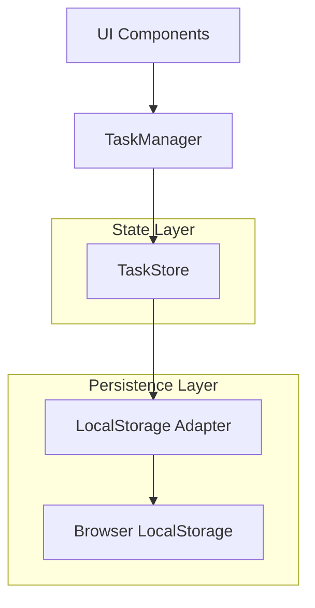
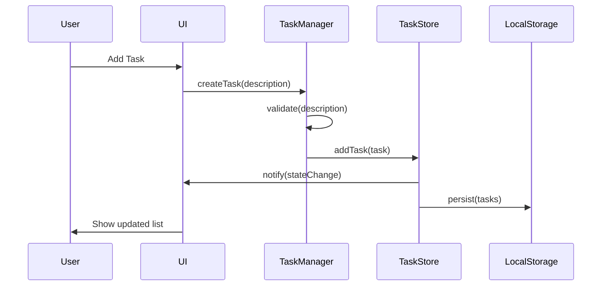

# Feature Design: Task Management System

## Overview

The Task Management System is a client-side application that enables users to create, manage, and track tasks. The system uses browser LocalStorage for persistence and provides a reactive UI for task operations.

### Key Design Decisions

1. **Client-side only**: No backend required, all data stored in LocalStorage
2. **Reactive state management**: UI updates automatically when task state changes
3. **Optimistic updates**: UI updates immediately, persistence happens asynchronously
4. **Type-safe**: Full TypeScript implementation with strict typing

## Architecture



### Data Flow



## Components and Interfaces

### TaskManager

The central orchestrator for all task operations.

```typescript
interface TaskManager {
  createTask(description: string): Result<Task, ValidationError>;
  toggleTask(id: string): Result<Task, NotFoundError>;
  deleteTask(id: string): Result<void, NotFoundError>;
  getTasks(filter?: TaskFilter): Task[];
}
```

### TaskStore

Manages task state and persistence.

```typescript
interface TaskStore {
  getAll(): Task[];
  getById(id: string): Task | null;
  add(task: Task): void;
  update(id: string, updates: Partial<Task>): void;
  remove(id: string): void;
  subscribe(listener: (tasks: Task[]) => void): () => void;
}
```

### LocalStorageAdapter

Handles serialization and persistence.

```typescript
interface LocalStorageAdapter {
  load(): Result<Task[], ParseError>;
  save(tasks: Task[]): void;
}
```

## Data Models

### Task

```typescript
interface Task {
  id: string;           // UUID v4
  description: string;  // Non-empty, trimmed
  completed: boolean;   // Default: false
  createdAt: Date;
  updatedAt: Date;
}
```

### TaskFilter

```typescript
type TaskFilter = 'all' | 'active' | 'completed';
```

### Validation Rules

| Field | Rule |
|-------|------|
| id | Valid UUID v4 format |
| description | Non-empty after trim, max 500 characters |
| completed | Boolean |
| createdAt | Valid Date, not in future |
| updatedAt | Valid Date, >= createdAt |

## Correctness Properties

*A property is a characteristic or behavior that should hold true across all valid executions of a system—essentially, a formal statement about what the system should do. Properties serve as the bridge between human-readable specifications and machine-verifiable correctness guarantees.*

### Prework Analysis

```
1.1 WHEN a user types a task description and presses Enter, THE TaskManager SHALL create a new task and add it to the TaskList
Thoughts: This is about adding valid tasks. We can generate random valid descriptions and verify the list grows by one.
Testable: yes - property

1.2 WHEN a user attempts to add a task with only whitespace characters, THE TaskManager SHALL reject the addition and maintain the current TaskList state
Thoughts: This tests input validation. We can generate whitespace-only strings and verify rejection.
Testable: yes - property

1.3 WHEN a new task is added, THE InputField SHALL clear its content and retain focus for the next entry
Thoughts: This is a UI behavior test. We can verify the input state after adding a task.
Testable: yes - property

1.4 WHEN a task is added, THE TaskManager SHALL persist the task to LocalStorage within 100 milliseconds
Thoughts: This is a timing requirement. We can test persistence but timing is harder to property-test.
Testable: yes - example

2.1 WHEN a user clicks on a task's checkbox, THE TaskManager SHALL toggle the task's completion status
Thoughts: Toggle is an involution (applying twice returns to original). This is a round-trip property.
Testable: yes - property

2.2 WHEN a task's completion status changes, THE TaskManager SHALL persist the change to LocalStorage within 100 milliseconds
Thoughts: Similar to 1.4, timing requirement.
Testable: yes - example

2.3 WHILE a task is marked as complete, THE TaskList SHALL display the task with a strikethrough style
Thoughts: This is a UI styling requirement.
Testable: no

3.1 WHEN a user clicks the delete button on a task, THE TaskManager SHALL remove the task from the TaskList
Thoughts: We can verify that after deletion, the task is no longer in the list.
Testable: yes - property

3.2 WHEN a task is deleted, THE TaskManager SHALL persist the change to LocalStorage within 100 milliseconds
Thoughts: Timing requirement.
Testable: yes - example

3.3 WHEN a task is deleted, THE TaskList SHALL update to reflect the removal without page refresh
Thoughts: This is about UI reactivity.
Testable: yes - property

4.1 WHEN the application loads, THE TaskManager SHALL retrieve all tasks from LocalStorage
Thoughts: This is about initialization. We can test by saving tasks, reloading, and verifying.
Testable: yes - property

4.2 WHEN LocalStorage contains invalid data, THE TaskManager SHALL initialize with an empty TaskList and log the error
Thoughts: Error handling for invalid data.
Testable: yes - property

4.3 WHEN a task operation occurs, THE TaskManager SHALL serialize the TaskList to JSON and store it in LocalStorage
Thoughts: This is about serialization. Round-trip property applies.
Testable: yes - property

5.1-5.4 Filter requirements
Thoughts: These are about filtering logic. We can verify filter results match expected criteria.
Testable: yes - property
```

### Property Reflection

After analysis, the following properties can be consolidated:
- Properties 1.4, 2.2, 3.2 are timing requirements - test as examples
- Property 4.3 subsumes individual persistence tests - use round-trip
- Filter properties 5.1-5.3 can be combined into one comprehensive filter property

### Properties

**Property 1: Task addition increases list length**

*For any* task list and valid (non-empty, non-whitespace) task description, adding it to the task list should result in the length of the task list growing by exactly one.

**Validates: Requirements 1.1**

---

**Property 2: Whitespace-only descriptions are rejected**

*For any* string composed entirely of whitespace characters (spaces, tabs, newlines), attempting to add it as a task should be rejected, and the task list should remain unchanged.

**Validates: Requirements 1.2**

---

**Property 3: Toggle is an involution**

*For any* task in the task list, toggling its completion status twice should return the task to its original completion state.

**Validates: Requirements 2.1**

---

**Property 4: Deletion removes exactly one task**

*For any* non-empty task list and any task ID present in the list, deleting that task should reduce the list length by exactly one and the deleted task should no longer be present.

**Validates: Requirements 3.1, 3.3**

---

**Property 5: Persistence round-trip**

*For any* valid task list, serializing to JSON and then deserializing should produce an equivalent task list with all tasks having identical properties.

**Validates: Requirements 4.1, 4.3**

---

**Property 6: Invalid data recovery**

*For any* invalid JSON string stored in LocalStorage, loading should result in an empty task list without throwing an exception.

**Validates: Requirements 4.2**

---

**Property 7: Filter correctness**

*For any* task list and filter type:
- "all" filter returns all tasks
- "active" filter returns only tasks where completed === false
- "completed" filter returns only tasks where completed === true

**Validates: Requirements 5.1, 5.2, 5.3**

## Error Handling

### Error Types

```typescript
type TaskError =
  | { type: 'validation'; message: string }
  | { type: 'not_found'; id: string }
  | { type: 'parse'; raw: string };
```

### Error Handling Strategy

| Error Type | Handling |
|------------|----------|
| Validation | Return error result, don't modify state |
| Not Found | Return error result, log warning |
| Parse | Initialize empty state, log error |

## Testing Strategy

### Property-Based Testing Framework

**Selected Framework**: fast-check (TypeScript)

### Test Configuration

- Minimum iterations: 100 per property
- Seed logging for reproducibility
- Shrinking enabled for minimal counterexamples

### Unit Tests

Unit tests will cover:
- Specific edge cases (empty string, max length)
- Error conditions
- Integration points

### Property Tests

Each correctness property will have a corresponding property-based test:

```typescript
// **Feature: task-manager, Property 1: Task addition increases list length**
// **Validates: Requirements 1.1**
test.prop([validTaskDescription()])('adding task increases length', (description) => {
  const initialLength = taskManager.getTasks().length;
  taskManager.createTask(description);
  expect(taskManager.getTasks().length).toBe(initialLength + 1);
});
```

### Test Organization

```
tests/
├── unit/
│   ├── task-manager.test.ts
│   ├── task-store.test.ts
│   └── local-storage-adapter.test.ts
└── properties/
    ├── task-operations.prop.ts
    ├── persistence.prop.ts
    └── filtering.prop.ts
```
