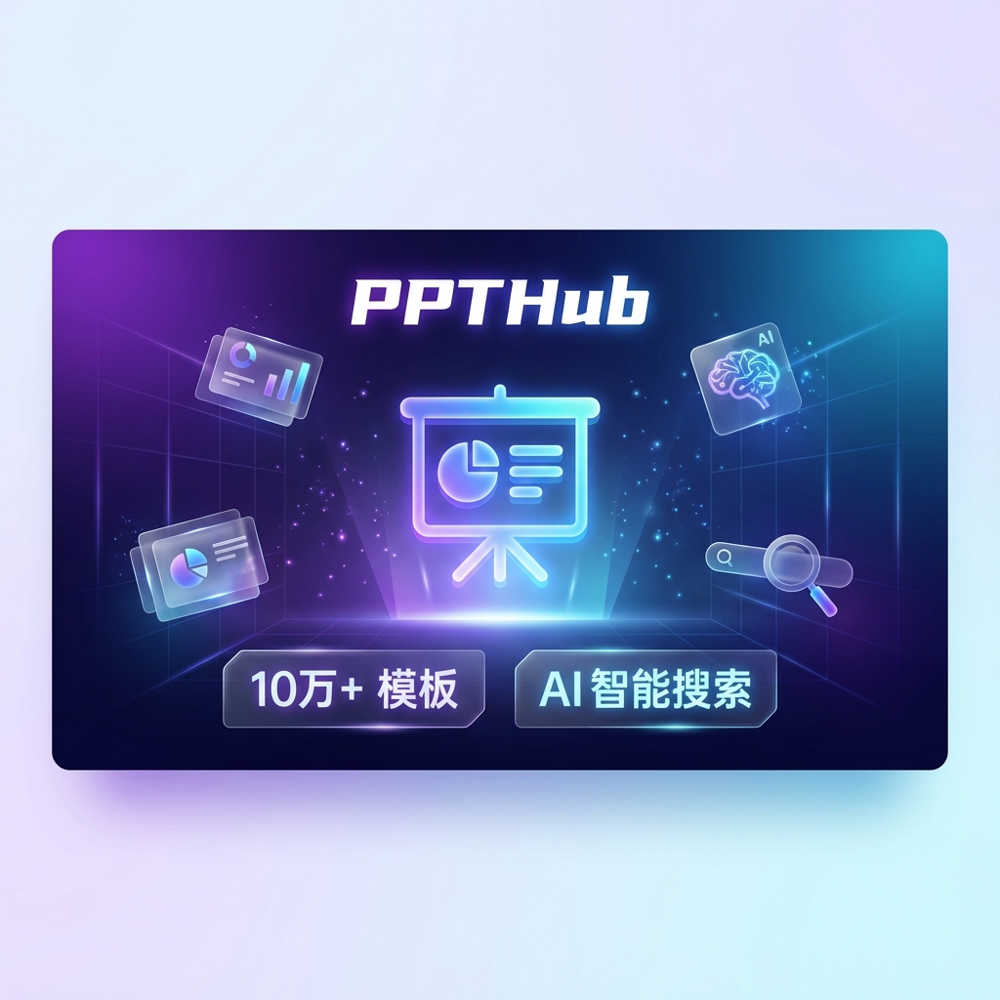
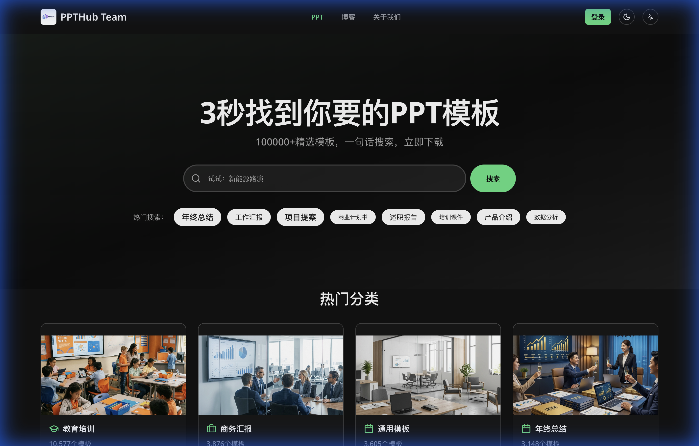
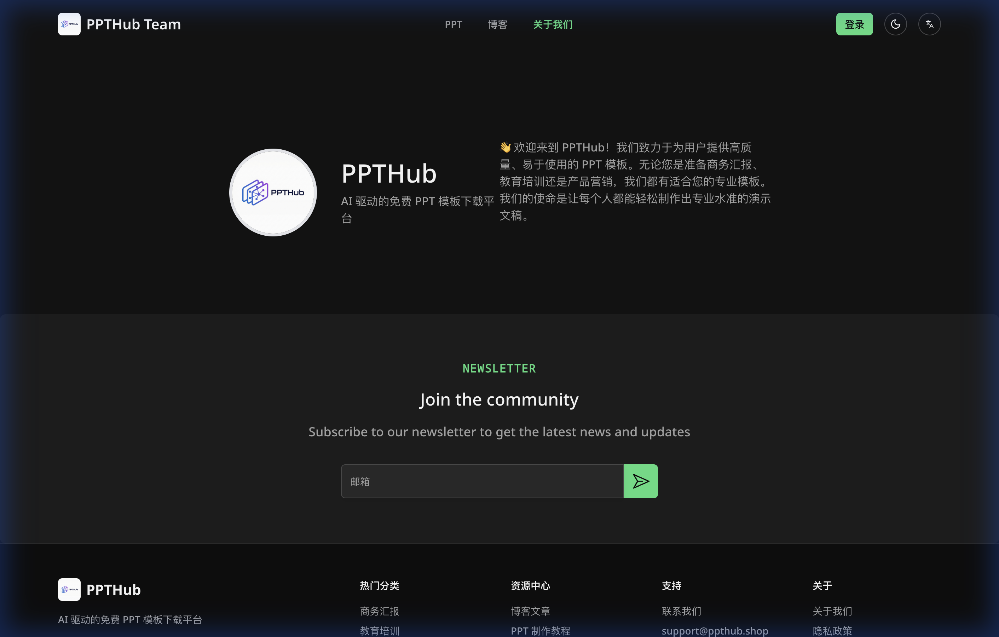
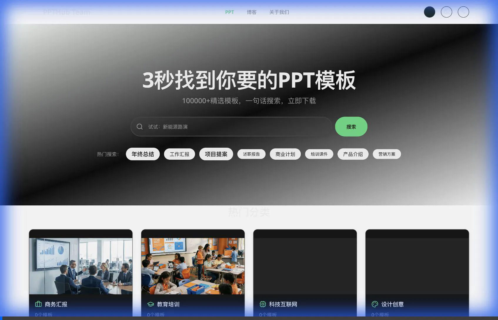

# PPTHub 微信公众号宣传软文

> **主题**：年终福利！10万+免费PPT模板，3秒精准找到你要的那一个

---

## 配图素材

### 宣传横幅

### 网站首页截图

### 关于我们页面

### 网站浏览录屏

---

## 正文（可直接复制）

---

**🎉 年末重磅！这个宝藏网站让我告别通宵做PPT的日子**

还在为年终总结、汇报PPT焦头烂额吗？

还在各大模板网站东翻西找，最后发现好看的全要会员？

今天给大家安利一个我私藏的**免费PPT模板神站**，用一句话形容：

> **"3秒找到你要的PPT模板"**

没错，就是这么丝滑！👇

---

### 🌟 网站名称：**PPTHub**

🔗 **官网地址**：[www.ppthub.shop](https://www.ppthub.shop)

---

### ✨ 为什么推荐它？三大核心亮点

#### 1️⃣ **10万+ 精选模板，全！部！免！费！**

不是那种"看起来免费，下载要充钱"的套路，是真正的**零门槛下载**。而且模板质量不输付费站！

涵盖 **8 大热门分类**：
- 📚 教育培训（10,500+ 模板）
- 💼 商务汇报（3,800+ 模板）
- 📊 年终总结（3,100+ 模板）
- 📝 述职报告（1,800+ 模板）
- 🎨 设计创意（1,200+ 模板）
- 🏥 医疗健康（1,000+ 模板）
- 📢 产品营销（780+ 模板）
- ⭐ 通用模板（3,600+ 模板）

#### 2️⃣ **AI 智能搜索，一句话就够**

忘记关键词筛选的痛苦吧！

直接告诉它你想要什么：
- "科技感的年终总结"
- "清新的教育课件"
- "蓝色商务风汇报"

AI 秒懂你的需求，精准推荐！这才是 2024 年该有的体验！

#### 3️⃣ **极简设计，极速体验**

网站设计简约高端，暗色主题看着就很专业。加载速度飞快，不卡顿不等待，选中就能下载。

---

### 💡 适合谁用？

| 人群 | 使用场景 |
|------|----------|
| 🎓 学生党 | 毕业答辩、课程作业、社团活动 |
| 💼 打工人 | 年终总结、项目汇报、述职演讲 |
| 🏫 教师 | 教学课件、培训材料、公开课 |
| 📈 创业者 | 商业计划书、产品路演、融资BP |

---

### 🚀 年末冲刺期，正是用它的时候！

2024 的最后几天，多少人还在为年终 PPT 头秃？

有了 **PPTHub**，省下的时间可以多睡两小时，多刷几部剧，或者…提前准备跨年！

---

### 📌 使用方式

1. 打开 **www.ppthub.shop**
2. 在搜索框输入你的需求（比如"极简年终总结"）
3. 挑选心仪模板，点击下载
4. 打开 PowerPoint，开始你的创作！

**就这么简单，3步搞定！**

---

### 📣 写在最后

好东西就要分享！

如果这篇推文帮到你了，记得 **点赞 + 在看 + 转发** 三连支持一下～

让更多人告别通宵做 PPT 的痛苦！

---

**🔗 立即访问**：[www.ppthub.shop](https://www.ppthub.shop)

---

*#PPT模板 #免费资源 #AI工具 #年终总结 #效率神器*

---

## 公众号排版建议

1. **标题**：使用引人注目的 emoji 开头
2. **配图位置**：
   - 开头放宣传横幅
   - 功能介绍部分放首页截图
   - 结尾放网站二维码（如有）
3. **重点文字**：用加粗或高亮色标注核心卖点
4. **引导语**：文末添加公众号关注引导和互动话题

---

## 建议的发布时间

- **最佳时间**：工作日早 8:00-9:00 或晚 20:00-22:00
- **特别推荐**：年终这几天（12月26日-31日），正是 PPT 刚需高峰期！
