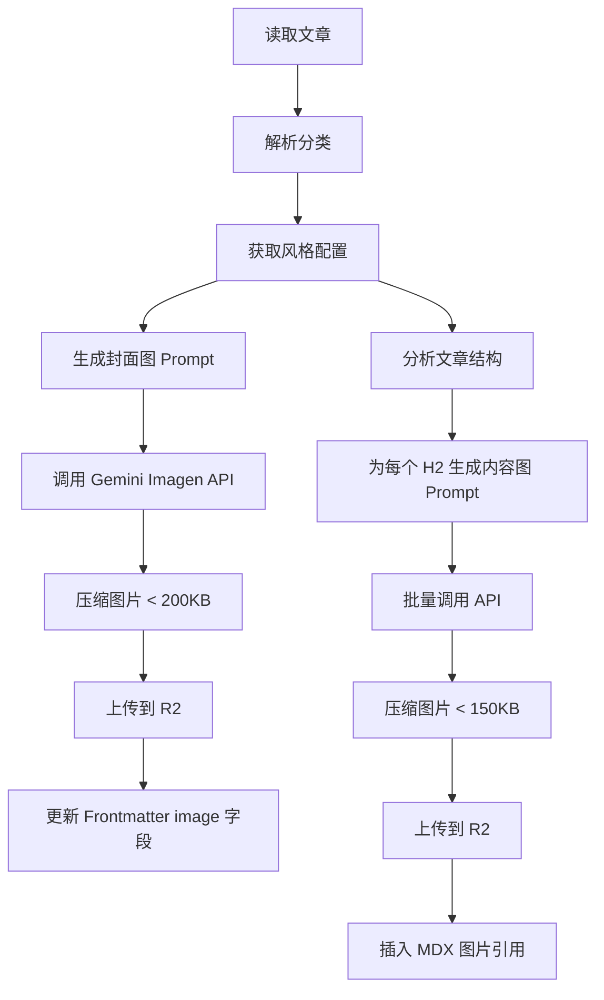

# 博客 SEO 优化综合方案

> **文档状态**: 2025-11-29 详细设计
> **目标**: 将 100 篇 PPT 博文优化为符合 SEO/GEO 标准的高质量内容，支持多语言发布

---

## 一、现状分析

### 1.1 现有博文结构

**分类分布（共 100 篇）：**

| 分类 | 数量 | 对应站点分类 |
|------|------|-------------|
| 通用与混合场景 | 24 篇 | `general` |
| 商务汇报 PPT | 9 篇 | `business` |
| 年终总结 PPT | 10 篇 | `summary` |
| 项目提案 PPT | 7 篇 | `proposal` |
| 教育培训与课件 PPT | 11 篇 | `education` |
| 产品营销与营销方案 PPT | 10 篇 | `marketing` |
| 述职报告 PPT | 10 篇 | `report` |
| 付费模板搜索与产品视角 | 19 篇 | `tips` |

### 1.2 当前 Frontmatter 结构分析

**现有字段（以商务汇报PPT为例）：**
```yaml
---
title: 商务汇报PPT一般包含哪些内容？从封面到总结的骨架拆解
description: 很多同事一听到「商务汇报」就头大...
image: /images/blog/post-18.png  # ⚠️ 使用占位图
date: "2025-11-27"
published: false  # ⚠️ 未发布
categories: [product]  # ⚠️ 分类不匹配
author: fox
---
```

**发现的问题：**
1. ❌ `categories` 使用 `[product]` 而非 PPT 分类（如 `business`）
2. ❌ `image` 使用占位图，无实际封面
3. ❌ `published: false` 全部未发布
4. ❌ 缺少 `tags` 字段（细粒度标签）
5. ❌ 缺少 `seoKeywords` 字段
6. ❌ 缺少 `relatedPosts` 字段
7. ❌ 内容图片全部缺失

### 1.3 SEO 优化评估

**内容质量（✅ 良好）：**
- 结构清晰，使用 H2/H3 标题层级
- 内容实用，解决用户痛点
- 语言流畅，适合阅读

**SEO 缺失项（❌ 需优化）：**
- 缺少权威数据引用（GEO 优化）
- 缺少内部链接（相关文章跳转）
- 缺少 FAQ 结构化数据
- 缺少图片 alt 文本
- 缺少 CTA（行动号召）

---

## 二、分类与标签体系设计

### 2.1 一级分类（Categories）

与 PPT 资源站 UI 对齐，映射到 `content/category/*.mdx`：

| 中文分类 | 英文 Slug | 描述 |
|---------|----------|------|
| 通用技巧 | `general` | 跨场景的 PPT 制作通用经验 |
| 商务汇报 | `business` | 商务汇报、工作汇报相关 |
| 年终总结 | `summary` | 年终总结、年度复盘相关 |
| 项目提案 | `proposal` | 项目提案、BP、路演相关 |
| 教育培训 | `education` | 教育培训、课件制作相关 |
| 产品营销 | `marketing` | 产品营销、营销方案相关 |
| 述职报告 | `report` | 述职报告、晋升汇报相关 |
| 模板技巧 | `tips` | 模板选择、搜索、改稿技巧 |

### 2.2 二级标签（Tags）

细粒度标签，用于多维度筛选：

```typescript
const tagSystem = {
  // 内容类型
  contentType: ['结构设计', '页数规划', '字体配色', '数据图表', '实战案例'],

  // 使用场景
  scenario: ['高层汇报', '团队分享', '路演', '线上会议', '线下演讲'],

  // 技能等级
  level: ['入门', '进阶', '专业'],

  // 功能标签
  feature: ['模板改稿', '搜索技巧', '付费模板', '免费资源'],
};
```

### 2.3 分类映射表

从现有 `pptCategory` 到新 `categories` 的映射：

```typescript
const categoryMapping: Record<PptCategoryName, string> = {
  '通用': 'general',
  '商务汇报': 'business',
  '教育培训': 'education',
  '培训课件': 'education',
  '产品营销': 'marketing',
  '营销方案': 'marketing',
  '年终总结': 'summary',
  '项目提案': 'proposal',
  '述职报告': 'report',
  '付费与搜索': 'tips',
};
```

---

## 三、Frontmatter Schema 扩展

### 3.1 目标 Schema

```typescript
// source.config.ts
export const blog = defineCollections({
  type: 'doc',
  dir: 'content/blog',
  schema: frontmatterSchema.extend({
    // 必填字段
    image: z.string(),
    date: z.string().date(),
    published: z.boolean().default(true),
    categories: z.array(z.string()),
    author: z.string(),

    // 新增字段
    tags: z.array(z.string()).optional().default([]),
    seoKeywords: z.array(z.string()).optional().default([]),
    relatedPosts: z.array(z.string()).optional().default([]),

    // 可选字段
    premium: z.boolean().optional(),
    readingTime: z.number().optional(), // 阅读时间（分钟）
    lastUpdated: z.string().date().optional(),
  }),
});
```

### 3.2 优化后的 Frontmatter 示例

```yaml
---
title: 商务汇报PPT一般包含哪些内容？从封面到总结的骨架拆解
description: 本文详解商务汇报PPT的9大核心模块，从封面、目录、背景到总结，帮你快速构建专业的汇报结构。
image: /images/blog/business-report-structure-cover.jpg
date: "2025-11-27"
published: true
categories: [business]
tags: [结构设计, 入门, 高层汇报]
seoKeywords: [商务汇报PPT, PPT结构, 工作汇报模板, PPT制作技巧]
relatedPosts: [business-report-pages, business-report-data, business-report-font]
author: pptx-team
readingTime: 8
---
```

---

## 四、数据库索引设计

### 4.1 blog_index 表结构

```sql
CREATE TABLE blog_index (
  id TEXT PRIMARY KEY,
  slug TEXT NOT NULL UNIQUE,
  locale TEXT NOT NULL DEFAULT 'zh',

  -- 基础信息
  title TEXT NOT NULL,
  description TEXT,
  image TEXT,
  date TIMESTAMP NOT NULL,
  published BOOLEAN NOT NULL DEFAULT true,

  -- 分类与标签
  categories TEXT[] NOT NULL DEFAULT '{}',
  tags TEXT[] DEFAULT '{}',
  seo_keywords TEXT[] DEFAULT '{}',

  -- 链接关系
  internal_links TEXT[] DEFAULT '{}',
  backlinks TEXT[] DEFAULT '{}',
  related_posts TEXT[] DEFAULT '{}',

  -- 元数据
  author TEXT NOT NULL,
  file_path TEXT NOT NULL,
  content_hash TEXT,
  reading_time INTEGER,
  view_count INTEGER DEFAULT 0,

  created_at TIMESTAMP DEFAULT NOW(),
  updated_at TIMESTAMP DEFAULT NOW()
);

-- 索引
CREATE INDEX idx_blog_locale ON blog_index(locale);
CREATE INDEX idx_blog_date ON blog_index(date DESC);
CREATE INDEX idx_blog_published ON blog_index(published);
CREATE INDEX idx_blog_categories ON blog_index USING GIN(categories);
CREATE INDEX idx_blog_tags ON blog_index USING GIN(tags);
```

### 4.2 blog_tag 表结构

```sql
CREATE TABLE blog_tag (
  id TEXT PRIMARY KEY,
  name TEXT NOT NULL,
  slug TEXT NOT NULL UNIQUE,
  locale TEXT NOT NULL DEFAULT 'zh',
  description TEXT,
  post_count INTEGER DEFAULT 0,
  created_at TIMESTAMP DEFAULT NOW()
);
```

---

## 五、SEO 优化流水线

### 5.1 优化检查清单

每篇文章需要通过以下检查：

```typescript
interface SEOCheckResult {
  // 基础检查
  hasTitleUnder60Chars: boolean;
  hasDescriptionUnder160Chars: boolean;
  hasValidImage: boolean;
  hasCorrectCategory: boolean;

  // 内容检查
  hasH2Headings: boolean;
  hasInternalLinks: boolean;
  hasExternalAuthority: boolean; // 权威引用
  hasFAQSection: boolean;
  hasCallToAction: boolean;

  // 图片检查
  hasCoverImage: boolean;
  hasContentImages: boolean; // 至少 3 张
  hasImageAltText: boolean;

  // SEO 字段
  hasTags: boolean;
  hasSeoKeywords: boolean;
  hasRelatedPosts: boolean;
}
```

### 5.2 批量优化脚本

```typescript
// scripts/optimize-blogs.ts

interface OptimizationTask {
  file: string;
  tasks: Array<
    | 'fix-category'      // 修正分类
    | 'add-tags'          // 添加标签
    | 'add-seo-keywords'  // 添加 SEO 关键词
    | 'add-authority'     // 添加权威引用
    | 'add-internal-links'// 添加内部链接
    | 'add-faq'           // 添加 FAQ
    | 'add-cta'           // 添加 CTA
    | 'generate-cover'    // 生成封面图
    | 'generate-content-images' // 生成内容图
  >;
}

async function optimizeBlog(task: OptimizationTask): Promise<void> {
  // 1. 读取 MDX 文件
  // 2. 解析 Frontmatter
  // 3. 执行优化任务
  // 4. 写回文件
}
```

### 5.3 GEO 优化增强

为每篇文章添加权威数据引用：

```markdown
<!-- 优化前 -->
商务汇报是职场上最常见的一类 PPT。

<!-- 优化后 -->
根据 2024 年职场效率报告，超过 78% 的职场人每月至少需要制作一次商务汇报 PPT，
而其中 65% 的人表示「不知道从哪里开始」是最大的困扰。
```

---

## 六、多语言翻译流程

### 6.1 翻译策略

1. **中文优先**: 所有文章先完成中文版本优化
2. **批量翻译**: 使用 AI 批量翻译为英文
3. **人工校对**: 关键文章进行人工校对

### 6.2 翻译 Prompt 模板

```markdown
Role: Expert Translator (Chinese to English)
Task: Translate the following MDX blog post into Native American English.

Constraints:
1. **Frontmatter**:
   - Translate `title` and `description`
   - KEEP `date`, `image`, `published`, `author` UNCHANGED
   - Translate `categories` values using mapping: 商务汇报->business, 年终总结->summary...
   - Translate `tags` values appropriately

2. **Content**:
   - Maintain MDX structure and components
   - Keep image paths unchanged
   - Translate naturally, not literally
   - Use business-appropriate tone

3. **Output**:
   - File naming: {slug}.mdx (Chinese version is {slug}.zh.mdx)
```

### 6.3 文件命名规范

```
content/blog/
├── business-report-structure.mdx      # 英文版
├── business-report-structure.zh.mdx   # 中文版
├── year-end-summary-guide.mdx
├── year-end-summary-guide.zh.mdx
└── ...
```

---

## 七、AI 图片生成方案

### 7.1 图片规格

| 类型 | 尺寸 | 大小限制 | 用途 |
|------|------|---------|------|
| 封面图 | 1200x630 | < 200KB | OG 图片、文章封面 |
| 内容图 | 800x600 | < 150KB | 文章配图 |

### 7.2 分类风格定义

每个 PPT 分类使用不同的视觉风格：

```typescript
const categoryStyles: Record<string, ImageStyle> = {
  business: {
    name: '商务专业',
    colors: ['#1E3A5F', '#2C5282', '#FFFFFF'],
    style: 'corporate, professional, clean lines, blue tones',
    elements: ['charts', 'graphs', 'office setting'],
  },
  summary: {
    name: '年终回顾',
    colors: ['#C53030', '#DD6B20', '#F6E05E'],
    style: 'celebratory, achievement, warm colors',
    elements: ['calendar', 'milestones', 'growth'],
  },
  proposal: {
    name: '项目提案',
    colors: ['#2B6CB0', '#38A169', '#FFFFFF'],
    style: 'innovative, forward-looking, tech-inspired',
    elements: ['lightbulb', 'roadmap', 'collaboration'],
  },
  education: {
    name: '教育培训',
    colors: ['#38A169', '#3182CE', '#F6E05E'],
    style: 'friendly, educational, engaging',
    elements: ['books', 'classroom', 'learning'],
  },
  marketing: {
    name: '产品营销',
    colors: ['#D53F8C', '#805AD5', '#38B2AC'],
    style: 'vibrant, creative, eye-catching',
    elements: ['products', 'campaigns', 'audience'],
  },
  report: {
    name: '述职报告',
    colors: ['#2D3748', '#4A5568', '#718096'],
    style: 'professional, trustworthy, achievement-focused',
    elements: ['career', 'growth', 'presentation'],
  },
  general: {
    name: '通用技巧',
    colors: ['#4299E1', '#48BB78', '#ECC94B'],
    style: 'versatile, helpful, practical',
    elements: ['tips', 'tools', 'workflow'],
  },
  tips: {
    name: '模板技巧',
    colors: ['#9F7AEA', '#ED64A6', '#4FD1C5'],
    style: 'modern, helpful, resource-focused',
    elements: ['templates', 'search', 'customization'],
  },
};
```

### 7.3 图片生成 Prompt 模板

**封面图 Prompt：**
```
Create a professional blog cover image for a PPT tutorial article.

Topic: {title}
Category: {category}
Style: {categoryStyle.style}
Color Palette: {categoryStyle.colors}

Requirements:
- Size: 1200x630 pixels
- Clean, modern design
- Include visual elements: {categoryStyle.elements}
- Text-free (no text in image)
- Professional quality suitable for business blog
```

**内容图 Prompt：**
```
Create an illustration for a PPT tutorial blog post.

Context: {sectionTitle}
Article Topic: {title}
Style: {categoryStyle.style}

Requirements:
- Size: 800x600 pixels
- Illustrative, not photographic
- Matches the article's professional tone
- No text in image
```

### 7.4 图片生成流程



---

## 八、实施计划

### Phase 1: 基础设施（1-2 天）

- [ ] 创建数据库表（blog_index, blog_tag）
- [ ] 扩展 Frontmatter Schema
- [ ] 创建分类 MDX 文件（content/category/*.mdx）

### Phase 2: 博文分析与优化（2-3 天）

- [ ] 运行 SEO 检查脚本，生成优化报告
- [ ] 批量修正分类映射
- [ ] 批量添加 tags 和 seoKeywords
- [ ] 添加内部链接和相关文章

### Phase 3: 内容增强（2-3 天）

- [ ] 为每篇文章添加权威数据引用
- [ ] 添加 FAQ 结构化内容
- [ ] 添加 CTA（行动号召）

### Phase 4: 图片生成（3-4 天）

- [ ] 实现图片生成服务
- [ ] 为 100 篇文章生成封面图
- [ ] 为每篇文章生成 3 张内容图
- [ ] 上传到 R2 并更新引用

### Phase 5: 多语言翻译（3-4 天）

- [ ] 批量翻译为英文
- [ ] 人工校对关键文章
- [ ] 验证双语文件结构

### Phase 6: 迁移与发布（1-2 天）

- [ ] 迁移到 content/blog 目录
- [ ] 同步数据库索引
- [ ] 设置 published: true
- [ ] 验证前端展示

---

## 九、预期成果

完成后将获得：

1. **100 篇优化后的中文博文** - 符合 SEO/GEO 标准
2. **100 篇英文翻译版本** - 支持多语言
3. **100 张封面图** - 按分类风格生成
4. **300+ 张内容图** - 每篇至少 3 张
5. **完整的数据库索引** - 支持内部链接和相关推荐
6. **分类/标签筛选系统** - 多维度内容发现

---

## 十、技术栈

- **内容管理**: Fumadocs MDX
- **数据库**: PostgreSQL + Drizzle ORM
- **图片生成**: Google Gemini Imagen API
- **图片存储**: Cloudflare R2
- **翻译**: Gemini Pro / GPT-4
- **构建**: Next.js 15 + pnpm
